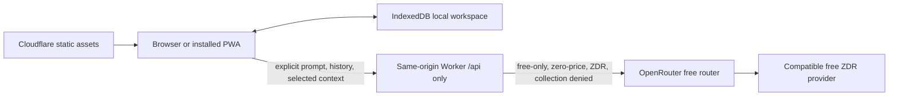

# CALIPAR PWA Demo Handoff

Updated: 2026-08-04 (America/Los_Angeles), second revision — Phases A–C of
`docs/plans/2026-08-04-public-beta-readiness.md` are implemented. Previously
2026-08-04 (first revision, which re-measured the local gates), 2026-08-03
(accessibility-contrast fixes), and 2026-07-31 (WebKit editor-opening diagnosis
and workspace-seam work).

**What changed in this revision.** The three Worker abuse findings are fixed and
unit-tested, the AI evaluation harness that `docs/TESTING.md` has specified since
the first handoff now exists and runs, the WCAG 2.5.3 brand-link defect and the
axe tag gap that hid it are both closed, and CI has been moved to where GitHub
will execute it. Phase D — the live Cloudflare preview, canary, and promotion —
is deliberately untouched and remains entirely open.

## Executive status

The standalone CALIPAR PWA demo is substantially implemented and the core
local-first architecture is working. It builds as a static Next.js application,
generates an installable Serwist service worker, persists synthetic workspace
data in IndexedDB, exposes no login requirement, and includes a same-origin
Cloudflare Worker that constrains OpenRouter requests to a free/privacy policy.

It is **not release-ready and has not been proven deployed**. Current blockers
are:

1. ~~Five serious/critical axe failures across the landing page, dashboard,
   reviews, chat, and settings.~~ **Resolved 2026-08-03.** Four were
   `color-contrast` misses between 4.15:1 and 4.48:1, fixed by retuning three
   text-bearing design tokens and moving the coral CTA to a deeper fill; the
   critical one was an unlabeled settings file input. `npm run test:a11y` now
   passes 11/11. See “Accessibility failures — resolved” below.
2. Lighthouse `lhci autorun` still exits 1 on `/` and `/dashboard/`. **Narrowed
   again 2026-08-04**: the WCAG 2.5.3 brand-link defect is now fixed and the axe
   suite can see it (blocker 6 below). Four per-audit `lighthouse:recommended`
   failures remain and are diagnosed rather than fixed — see “Lighthouse
   residual, diagnosed 2026-08-04”. All four category budgets still pass;
   accessibility is 1.00 on both URLs.
3. ~~One WebKit editor-opening timing failure.~~ **Resolved.** It was not a
   flake. `ReviewEditor` latched its copy of the review at mount
   (`useState(() => source ?? null)`) and never re-read it, so when navigation
   landed on the editor before the workspace snapshot was ready the component
   stayed on “Opening review…” permanently. Fixed by deriving the review rather
   than latching it. The full E2E suite now passes 37/37 with 5 skipped. See
   “WebKit editor-opening race” below.
4. Codex Security scan `a68f98b4-8e52-4630-96b2-90a25ee518ec` remains unsealed
   and is now **unreachable** — the Codex Security tool was not available in the
   2026-08-04 working session, so the scan could not be loaded, finalized, or
   confirmed alive. It was last observed on 2026-07-30 running in reporting at
   8/15 artifacts, its workspace is an OS-temporary path, and the tree has moved
   far past the scanned snapshot. **Do not treat it as a source of truth.** Its
   three abuse findings are now fixed in code — see “Security finding
   disposition” — but a fresh scan against the release commit is still owed.
5. No authenticated Cloudflare preview, live OpenRouter canary, promotion, or
   production smoke test has been completed or verified in this handoff.
6. ~~One genuine WCAG 2.5.3 brand-link defect the axe suite was blind to.~~
   **Resolved 2026-08-04** in `cedf2fd`. Both causes are closed: the axe tag list
   now includes `wcag21a`/`wcag22a` and explicitly enables
   `label-content-name-mismatch`, and the `aria-label` on the brand link is gone
   so its accessible name contains its visible text. `npm run test:a11y` passes
   12/12, up from 11 — `/reviews/editor/` was added to the sweep, having been
   required by both artifact verifiers but never checked for accessibility.
7. ~~CI has never been observed running on GitHub.~~ **Resolved 2026-08-04.**
   `pwa-demo-ci.yml` moved to the parent repository root and fired for the first
   time on PR #1 (run `30956933461`). That first run found a real defect: it
   failed at `test:unit` with `webidl.util.markAsUncloneable is not a function`
   — **all 12 jsdom test files failed to start their workers on Node 20**,
   because `jsdom@30` depends on `undici@8`, which declares
   `engines: node >=22.19.0`. The `engines` floor of `>=20.9.0` was simply
   false, and no local run could have caught it: every local check had been on
   Node 22.23.0. Engines and both CI jobs are corrected to Node 22. **This is
   exactly the class of thing "a green local run is not evidence CI works" was
   pointing at.** CI is now **green on `main`**: run `30958654379`
   ("CALIPAR PWA demo") against `1f78dc4`, 2026-08-04T23:03Z, conclusion
   `success`.

   **What green CI does and does not cover.** The passing job is
   `Build, test, and evaluate` — typecheck, lint, unit, worker, eval, build,
   artifact verification. The second job, `Authenticated Cloudflare dry run`,
   was **skipped** (it requires credentials absent on this trigger). Lighthouse
   was deliberately removed from CI on 2026-08-04, and the browser suites are
   not in it either. **Green CI is therefore a subset of `npm run verify:full`,
   which remains the release gate and has not been run against `1f78dc4` on a
   clean `npm ci`.** Do not read the green badge as release readiness; blockers
   2, 4, and 5 are untouched by it.

Do not describe this build as launched, production-ready, fully accessible, or
security-cleared until those gates are closed with fresh evidence.

## Repository and scope boundary

Work only in:

```text
/Users/laccd/code/calipar/calipar_pwa_demo
```

This is intentionally separate from the parent production CALIPAR stack. It
does not use or weaken Firebase authentication, FastAPI, PostgreSQL, production
demo-mode data separation, or the existing Gemini integration.

Git state:

- The directory has no nested `.git` repository; it is tracked in the parent
  repository at `/Users/laccd/code/calipar`.
- The package **is tracked**, on branch `feat/pwa-demo-workspace-seam`. It was
  first committed on 2026-07-31 in `c5d1518 feat: track the CALIPAR PWA demo
  package`, off parent HEAD `ddb6070cec7869ce0f6ff3ff8baa5c37544dfcc1`. Before
  that commit the whole directory was untracked, so there is no per-file history
  earlier than it.
- Commits since, oldest first: `16ec12d` gitignore the local issue tracker,
  `5a42aa0` session handoff and architecture review, `8dff02c` domain glossary
  and ADRs 0001–0003, `5580d23` rename `getWorkspaceSnapshot` to `readWorkspace`,
  `32ab983` derive the workspace from one reading, `746c876` one definition each
  for the workspace derivations.
- The 2026-08-03 accessibility fixes were committed on 2026-08-04 together with
  this revision; before that they existed only in the working tree, so any
  earlier clone of this branch does **not** contain them.
- Generated output is excluded by the nested `.gitignore`: `node_modules/`,
  `.next/`, `out/`, `.wrangler/`, `.lighthouseci/`, `test-results/`,
  `playwright-report/`, `.dev.vars`, and local workspace exports.
- `openrouter-llms-full.txt` is a 3.5 MB local reference dump. It was already
  excluded from asset uploads by `.assetsignore`, `serwist.config.js` and
  `scripts/verify/artifacts.mjs`; it is now also gitignored, so it is **not** in
  history. Re-download it rather than committing it.

## Product behavior implemented

The public landing page leads directly into a synthetic Demo Program Review
Lead workspace. There is no authentication screen or role selector.

Implemented application routes:

| Route | Purpose |
| --- | --- |
| `/` | Public landing page, product/privacy framing, demo entry |
| `/dashboard/` | Repository-derived review horizon and activity summary |
| `/reviews/` | Local review portfolio |
| `/reviews/new/` | Create a browser-local review |
| `/reviews/editor/?id=<id>` | Static route for editing an IndexedDB-created review |
| `/data/` | Aggregate synthetic outcomes and accessible tables |
| `/planning/` | Local action-plan workflows |
| `/resources/` | Local resource-request workflows |
| `/activity/` | Transaction-generated activity history |
| `/chat/` | Mission-Bot disclosure, selected context, local history, AI UI |
| `/settings/` | Preferences, workspace export/import/reset |
| `/offline/` | Offline fallback/status page |

Important data behavior:

- IndexedDB database name: `calipar-demo`.
- Domain and activity changes use repository transactions.
- Seed data is deterministic and synthetic.
- Reset flushes/clears/reseeds domain and chat data while preserving intended
  lightweight preferences.
- Export is versioned, unencrypted JSON.
- Import is replace-only, validates references and schema versions, sanitizes
  text, offers a pre-import backup, and is expected to be atomic on failure.
- `BroadcastChannel` notifies same-origin tabs after committed changes.
- The service worker precaches static application routes/assets; `/api/*` is
  network-only and AI requests are not queued offline.

## Architecture and trust boundaries



Cloudflare configuration uses one Worker with Static Assets:

- Worker entry: `worker/index.ts`
- Static export: `out/`
- Worker-first routes: `/api/*` only
- No D1, KV, R2, Durable Objects, server-side application database, queue, or
  scheduled data reset
- Rate-limit binding: five AI task requests per 60 seconds
- Static routes bypass Worker invocation

The Worker owns the upstream request. The browser cannot select a model,
provider, URL, tool, price, token limit, or privacy relaxation. Intended
provider policy includes `model: "openrouter/free"`, zero maximum prices,
zero-data-retention routing, provider data collection denied, and free-only
fallback. A short-lived signed `HttpOnly`, `Secure`, `SameSite=Strict` cookie
is minted after Turnstile verification.

The privacy statement must remain precise: the workspace is local, but a user
who invokes AI sends the prompt, included conversation history, and selected
context through Cloudflare to OpenRouter and a routed provider. Never claim
that AI inputs remain entirely on-device.

## Important code and documentation

| Area | Paths |
| --- | --- |
| App shell/routes | `app/`, `components/app-shell.tsx` |
| Workspace seam | `components/workspace-provider.tsx` — `WorkspaceStateProvider` is the presenter that owns the private context; `WorkspaceProvider` is the IndexedDB-backed adapter around it. `useWorkspace()` is the only read interface. Tests supply state through `WorkspaceStateProvider` and never mock the module path. |
| Component test fixtures | `tests/support/workspace-fixture.ts` — typed builders for `WorkspaceData`, `WorkspaceDerivations` and the three workspace states |
| Review editor/autosave | `components/review-editor.tsx`, `app/(demo)/reviews/editor/page.tsx` |
| Browser persistence | `lib/db/database.ts`, `lib/db/repository.ts` |
| Domain contracts/derivations | `lib/domain/`, `lib/seed/data.ts` |
| Import sanitization | `lib/utils/sanitize.ts` |
| Browser AI client/contracts | `lib/ai/client.ts`, `lib/ai/contracts.ts` |
| Worker AI/session/SSE logic | `worker/index.ts` |
| PWA | `app/manifest.ts`, `app/sw.ts`, `serwist.config.js`, `public/icons/` |
| Cloudflare config/scripts | `wrangler.jsonc`, `scripts/cloudflare/` |
| Artifact/security checks | `scripts/verify/`, `.assetsignore`, `public/.assetsignore` |
| Tests | `tests/unit/`, `tests/worker/`, `tests/e2e/`, `tests/a11y/` |
| Domain vocabulary and decisions | `CONTEXT.md` — the ubiquitous language for the workspace, derivations and activity; `docs/adr/0001`–`0003` — why derivations read the workspace once, fill the existing workspace slot, and carry their counts. Read these before changing `lib/domain/` or `components/workspace-provider.tsx` |
| Architecture/privacy/release docs | `docs/ARCHITECTURE.md`, `docs/PRIVACY_AND_AI.md`, `docs/TESTING.md`, `docs/CLOUDFLARE_DEPLOY.md` |
| Session handoffs | `docs/handoffs/` — carry-over context for continuing work. Newest: `2026-07-31-workspace-seam.md`. The 2026-08-03 accessibility session has no handoff of its own; its record is the “Accessibility failures — resolved” section below |
| Implementation plans | `docs/plans/` — task-by-task plans for work not yet done. Newest: `2026-08-04-public-beta-readiness.md`, the route from here to an unlisted public beta |
| Architecture reviews | `docs/architecture-reviews/` — deepening candidates with before/after diagrams. Newest: `2026-07-31-deepening-candidates.html`; candidates 2, 4 and 5 are still open |

Package versions are pinned in `package.json` and `package-lock.json`. At this
handoff, the lockfile SHA-1 is
`19536eb6314ed8a08b8767ebbe145aa292484f7f`.

## Verification performed for this handoff

Environment:

```text
Node.js v22.23.0
npm 10.9.8
Next.js 16.2.12
Wrangler 4.115.0
```

The package permits Node 22.19 through 22.x, and CI now runs Node 22. **The
previous "clean Node 20 run required before release" item was impossible**, not
merely undone: the first CI run (2026-08-04, PR #1) failed every jsdom test file
with `webidl.util.markAsUncloneable is not a function`, because `jsdom@30`
depends on `undici@8`, which declares `engines: node >=22.19.0`. The engines
floor and both CI jobs were corrected to match reality. Local Node 22 evidence
is therefore the release evidence, not a stand-in for it.

Every row below was **re-measured 2026-08-04 (second revision)** against the
current tree, at host load average 2.3–2.8. Nothing is carried over. E2E,
Lighthouse, and a11y verdicts are only trustworthy on a quiet host — check
`uptime` before believing any of them.

| Check | Current result | Previous |
| --- | --- | --- |
| `npm run typecheck` | Pass | Pass |
| `npm run lint` | Pass, zero warnings | Pass |
| `npm run test:unit` | Pass: 12 files, 87 tests | 11 files, 75 tests |
| Unit coverage, `lib/**` | `lib/ai` 92.77 / 82.97 / 100 / 96.05, `lib/db` 92.41 / 92.30 / 90.16 / 92.59, `lib/domain` 100 / 96.77 / 100 / 100, `lib/utils` 83.33 / 76.92 / 85.71 / 83.33 (statements / branches / functions / lines). Gate: 85 / 80 / 85 / 85 | — |
| Unit coverage, `components/**` | 36.86 / 42.54 / 32.83 / 39.55. Gate: 25 / 28 / 25 / 27 | unchanged |
| `npm run test:worker` | Pass: 4 files, 68 tests | 1 file, 29 tests |
| Worker coverage | 93.40% statements, 86.87% branches, 97.56% functions, 94.23% lines. Gate: 90 / 85 / 90 / 90 | 92.41 / 86.10 / 96.55 / 93.57 |
| `npm run test:eval` | Pass: 5 files, 45 tests | **did not exist** |
| `npm run build` | Pass: 15 static pages; Serwist precached 51 URLs totaling 1.48 MB | 1.47 MB |
| `npm run verify:artifacts` | Pass: 156 exported assets; manifest digest `95b0a5801f0729f7` | `d62c4f88c6966002` |
| `npm run cloudflare:limits` | Pass: 156 assets, 1,792,789 bytes, within static Free limits | 1,779,381 bytes |
| `npm run cloudflare:dry-run` | Pass: Worker gzip 10,926 bytes against a 3 MiB ceiling; all three rate-limit bindings reported registered. **Needs no authentication** | gzip 9,291 bytes |
| `npm run test:e2e` | Pass: 41 passed, 19 skipped, 0 failures | 37 passed, 5 skipped |
| `npm run test:a11y` | Pass: 12 passed, with `wcag21a`/`wcag22a` asserted and `label-content-name-mismatch` enabled | 11 passed, weaker tag list |
| `npm run test:lighthouse` | Fail on both collected URLs — four per-audit failures, all four category budgets pass | Fail, five per-audit failures |
| `npm run verify` | **Pass end to end**, including the new `test:eval` step | — |

The skipped E2E count rose from 5 to 19 because `ai-abuse.spec.ts` is scoped to
`chromium-desktop` and the live-AI canary grew from one test to three; all are
skips by design, not silent failures.

Both coverage rows are aggregates over the configured glob in `vitest.config.ts`,
which excludes `lib/seed/**`, `lib/domain/types.ts`, and the icon components. The
`components/**` floor is set deliberately just under the real number to stop the
layer regressing to unmeasured; ratchet it up as `modal.tsx` and `pwa-bridge.tsx`
gain tests. Quote these numbers from a fresh run, not from this table — an
earlier revision carried a unit row that disagreed with its own prose.

### WebKit editor-opening race — resolved

The failure was:

```text
[webkit] tests/e2e/review-persistence.spec.ts
creates, autosaves, reloads, and submits a local review
```

After navigation to the new editor URL the page remained at `Opening review…`
and `data-testid="review-editor"` never appeared. It presented as a flake
because it needed contention to reproduce — roughly 1-in-10 under the standard
two-worker run, and green on a focused rerun.

**Root cause.** `components/review-editor.tsx` initialised its copy of the
review once, at mount, from the workspace snapshot and never re-read it. When
navigation landed on the editor before `WorkspaceProvider` had refreshed, that
initial read found nothing and the component's own recovery branch could not
fire: it required `state.status === "ready" && !source`, but once the snapshot
arrived `source` was truthy, so the render fell through to `Opening review…`
**permanently**. Not a slow load — a deadlock.

**Fix.** Derive the review instead of latching it, so a late snapshot still
opens the editor while unsaved local edits keep precedence:

```ts
const [draft, setDraft] = useState<ReviewRecord | null>(null);
const review = draft ?? source ?? null;
```

An earlier attempt used a `useEffect` to sync the value; it worked but tripped
`react-hooks/set-state-in-effect` against the zero-warning lint gate. Deriving
removes the failure mode rather than patching it.

**The same defect existed a second time** at `app/(demo)/reviews/new/page.tsx`,
where `useState(programs[0]?.id ?? "")` latched the program to `""` on a
non-ready first render — papered over by `|| programs[0]?.id || ""` fallbacks at
the submit handler and the `<select>`. Also fixed by deriving; both fallbacks
removed.

**Regression cover.** `tests/unit/review-editor-mount.test.tsx` and
`tests/unit/reviews-new-latch.test.tsx` reproduce the mount ordering
deterministically in about a second, with no browser and no IndexedDB. Both were
verified red against the reverted fixes.

Note for whoever tests this next: a non-`multiple` `<select>` reports its first
option's value when nothing matches, so asserting on the rendered select value
cannot distinguish the latched case from the derived one. Assert on what the
submit handler passes to `createReview` instead.

### Accessibility failures — resolved

The axe gate found five material failures, across nine nodes:

| Route | Violation and selectors |
| --- | --- |
| `/` | `color-contrast`: `.button-coral`, `.chart-note > span`, `#privacy > div:nth-child(1) > .eyebrow` |
| `/dashboard/` | `color-contrast`: `.draft` |
| `/reviews/` | `color-contrast`: `.draft` |
| `/chat/` | `color-contrast`: `.chat-context > p:nth-child(3)` and the three context-list `small` elements |
| `/settings/` | Critical `label`: hidden import file `input[data-testid="settings-import"]` has no accessible label |

All were fixed at the token and markup level; nothing was suppressed and no
axe rule or tag was narrowed.

**Contrast.** Four of the five were one root cause each — a token carrying small
text at 7–11px on a light surface. Values were taken from axe's own
`failureSummary` rather than derived by hand, because several of the surfaces
are composited (`rgba` over a card over the page background) and hand-computed
backdrops would have been wrong. Each replacement is a hue-preserving darkening
targeting roughly 4.75:1, so none of them sits on the 4.5 line:

| Token | Was | Now | Worst pair it must clear |
| --- | --- | --- | --- |
| `--sea` | `#0b6e75` | `#0b6970` | 4.48 → 4.80 on `--sea-light` `#c7e5df` |
| `--muted` | `#61737a` | `#5b6c73` | 4.37 → 4.77 on `.chat-context` `#eef2ed` |
| `--warning` | `#9c641f` | `#8f5c1c` | 4.15 → 4.76 on the draft pill `#f7ead6` |
| `--coral-dark` | `#c64f3d` | `#b94f3c` | white text 3.22 → 4.95 (see below) |

`--sea` has 55 usages and `--muted` 54, so before changing either, every backdrop
each one lands on was checked, not just the failing one. Both are used only as
foreground-on-light or as a background behind white text, and darkening improves
*both* roles — white on `--sea` went 6.00 → 6.42. The status pills that were
already passing keep headroom: `success` 4.75, `in-review` 5.66, `declined` 5.57.

**The coral CTA is a deliberate visible change.** White on `--coral` `#e96752`
measured 3.22:1, and `--ink` on `--coral` is only 4.36:1, so no text colour
rescues the bright fill — the fill itself had to deepen. `.button-coral` now
takes `--coral-dark`, with a new `--coral-deep` `#a3452f` for hover. **`--coral`
itself is unchanged**, because it is the right colour for the ~15 decorative
rules, progress bars and dots that carry no text and therefore have no contrast
obligation. The original bright-coral `box-shadow` is kept, so the button still
reads as a coral CTA rather than a muddy brick. `.button-coral` was verified to
be the only text-bearing coral surface; `.hero-eyebrow span` is a 30×1px rule
and `.send-button.stop span` is a 10×10px glyph on a button that already carries
`aria-label="Stop generation"`.

A comment above the three text-bearing tokens in `styles/globals.css` records
that they are contrast-tuned. **Lightening any of them re-breaks `tests/a11y`** —
recompute before changing.

**The critical failure** was the `sr-only` file input at
`app/(demo)/settings/page.tsx`. It now has an `sr-only` `<label htmlFor>` rather
than an `aria-label`, so the accessible name is a real label element that
survives refactors and stays visible to translation tooling. `.sr-only` is
absolutely positioned, so the added label does not disturb the flex row.

**Result:** `npm run test:a11y` passes 11/11, was 6 passed / 5 failed. The rest
of the suite is unchanged: e2e 37 passed / 5 skipped at host load 4.5, unit
11 files / 75 tests, worker 1 file / 29 tests, typecheck and lint clean, build
still 51 precached URLs at 1.47 MB.

**Two things left deliberately alone.** The chat context strings render at 7px
and the pills at 9px; contrast now passes, but that is small enough to be a real
legibility problem and is a design call, not a gate. Separately, 10 declarations
hardcode `rgba(11,110,117,…)` — the *old* `--sea` RGB — as borders and shadows.
All are decorative with no contrast obligation, so they were left, but they are
now ~1.5% off the token they were duplicating.

### Lighthouse failures — accessibility cleared, performance outstanding

Rerun 2026-08-03 after the contrast fixes, two runs each for `/` and
`/dashboard/`. **`lhci autorun` still exits 1.** What changed is which gate is
failing.

All four configured category budgets now pass, and the accessibility category is
perfect on both URLs:

| Category | Budget | `/` before → after | `/dashboard/` before → after |
| --- | --- | --- | --- |
| accessibility | 0.95 | 0.95 → **1.00** | 0.96 → **1.00** |
| best-practices | 0.90 | 0.96 → 0.96 | 0.96 → 0.96 |
| seo | 0.90 | 1.00 → 1.00 | 1.00 → 1.00 |
| performance | 0.80 | 0.85 (0.65 on the slower run) | 0.85 (0.77 on the slower run) |

`color-contrast` has disappeared from the Lighthouse audit failures entirely, on
both URLs. The remaining exit-1 comes from the `lighthouse:recommended` preset,
which asserts every individual audit at `minScore 0.9` regardless of that
audit's weight in its category — so a zero-weight audit can fail the run while
the category it belongs to scores 1.00. That is exactly what is happening.

Remaining failing audits, identical on both URLs unless noted:

| Audit | Score | Nature |
| --- | --- | --- |
| `label-content-name-mismatch` | 0 | **Real accessibility defect** (`/dashboard/` only) — see below |
| `inspector-issues` | 0 | One Chrome DevTools issue, type "Content security policy" |
| `unused-javascript` | 0 | 2 chunks; ~72 KB unused of a 110 KB chunk, ~26–29 KB of a 71 KB chunk |
| `legacy-javascript` / `-insight` | 0–0.5 | 13.9 KB of polyfill, signal `Array.prototype.at` |
| `network-dependency-tree-insight` | 0 | Critical request chain depth |
| `render-blocking-resources` / `-insight` | 0 | One render-blocking request |
| `largest-contentful-paint` | 0.4 | Warning-level; LCP element also scores 0 |
| `interactive` | 0.79–0.85 | Warning-level, run-to-run variance |

Performance numbers swing hard between the two runs in a single collection
(`/` scored 0.65 and 0.85; `/dashboard/` 0.77 and 0.85), so treat any single
performance figure as noise unless the host is quiet. Check `uptime` first, as
with E2E. The remaining work is a Next.js bundle question — unused and legacy
JavaScript, the render-blocking request, and the request chain — not a design or
markup question.

Do not loosen the recommended preset or the category budgets merely to get a
passing result. If an individual zero-weight audit is genuinely not actionable,
disable *that audit* with a recorded justification rather than dropping the
preset. Reports are under `test-results/lighthouse/` (gitignored).

### Lighthouse residual, diagnosed 2026-08-04

Re-measured on a quiet host (load 4.05) after the Task 10 accessibility fix and
an explicit `browserslist`. Accessibility is **1.00** on both URLs and
`label-content-name-mismatch` is gone. Performance 0.85 on `/`, 0.84–0.85 on
`/dashboard/`. Four per-audit failures remain, each diagnosed:

| Audit | Measurement | Diagnosis |
| --- | --- | --- |
| `legacy-javascript` | 13,705 bytes in one chunk; signals `Array.prototype.at`, `.flat`, `.flatMap`, `Object.fromEntries`, `Object.hasOwn`, `String.prototype.trimEnd`, `.trimStart` | **Not fixed by browserslist.** An explicit modern baseline (Chrome/Edge 92, Firefox 90, Safari 15.4, plus the Android and Samsung engines) raised global coverage 81.44% → 83.92% and left this audit byte-for-byte identical. Next 16 emits the chunk into the main graph regardless of targets, and it is **not** loaded with `nomodule`. Fixing it means changing how Next bundles, not how the project is configured. |
| `unused-javascript` | ~99 KB across two chunks: 73,239 of 110,368 bytes (69%) and 28,583 of 71,245 | **Not a lazy-loading problem, and `recharts` is not the cause.** The large chunk contains `dompurify`, `zod`, and `scheduler`; `recharts` is absent from the bundle entirely. Most of a validation or sanitisation library's surface is unreachable from any single page, so this figure is largely structural. `next/dynamic` has nothing here to defer. |
| `render-blocking-resources` | one request, 12,690-byte CSS, ~120–130 ms | `styles/globals.css`, the hand-authored design system. Render-blocking by design. |
| `inspector-issues` | one issue, type "Content security policy", no sub-items | `'unsafe-inline'` in the `script-src` of `public/_headers`. Next's inline bootstrap needs it, and `output: "export"` means there is no server to mint a nonce. Removing it breaks the app. |

**Disposition, decided 2026-08-04.** The preset and all four category budgets
are untouched. Two audits — `legacy-javascript` (with its `-insight` variant)
and `inspector-issues` — are disabled individually in `lighthouserc.cjs`, each
with the justification above written into the config beside it. Both are
structural to Next static export rather than to this codebase: the polyfill
chunk is emitted regardless of build targets and is not `nomodule`, and
`'unsafe-inline'` is required because there is no server to mint a CSP nonce.

`test:lighthouse` **still exits 1**, now on two audits rather than four:
`unused-javascript` and `network-dependency-tree-insight`. Those were left
enabled deliberately — unlike the other two they would genuinely improve with
route-level code splitting, so silencing them would hide real work.

**Lighthouse is no longer a CI step.** It measures performance, and a shared
runner's performance numbers are noise — one local collection produced 0.65 and
0.85 for the same URL in the same run purely from host load. A gate that fails
for reasons unrelated to the change teaches people to ignore red. It remains a
release gate run locally on a quiet host through `npm run verify:full`.

Re-measure before trusting any figure above: the post-disable run was taken at
load average 23.5, which is too loaded to trust *timing* audits. The two
remaining failures are byte counts and request-chain structure, which are
load-independent.

**Unrelated finding worth acting on.** Six declared dependencies are imported
nowhere in `app/`, `components/`, or `lib/`: `recharts`, `react-markdown`,
`lucide-react`, `clsx`, `tailwind-merge`, and `zustand`. They are already
tree-shaken out, so removing them changes no Lighthouse number — but it removes
real install time and supply-chain surface. Not removed here: dropping
dependencies needs `npm install`, which the release rules forbid mid-release.

#### `label-content-name-mismatch` — RESOLVED 2026-08-04 (was: a WCAG 2.5.3 failure the axe gate could not see)

**Both causes below are now closed** (`cedf2fd`). The `aria-label` is deleted, so
the accessible name comes from the content and contains the visible text; the
tag list gained `wcag21a`/`wcag22a` and the rule is explicitly enabled. Verified
red-then-green: with the tags widened and the rule on, `/dashboard/` failed with
`label-content-name-mismatch: serious` on `.brand[aria-label="CALIPAR dashboard"]`
before the fix, and the suite passes 12/12 after. The original analysis follows,
because the two-independent-causes structure is the reusable lesson.

Lighthouse flags the sidebar brand link in `components/app-shell.tsx:21`:

```tsx
<Link aria-label="CALIPAR dashboard" className="brand" href="/dashboard/">
```

Its visible text is "CALIPAR" plus "Program Review · Demo", but its accessible
name is "CALIPAR dashboard". WCAG 2.5.3 (Label in Name, **Level A**) requires the
accessible name to contain the visible label text, so speech-input users saying
"CALIPAR program review" cannot address the control. (Historical: this was the
state before `cedf2fd`; the `aria-label` no longer exists.)

**`npm run test:a11y` will never catch it**, for two independent reasons, and
both must be fixed to close the gap:

1. `tests/a11y/routes.spec.ts` asserts on tags
   `wcag2a, wcag2aa, wcag21aa, wcag22aa`. The rule is tagged `wcag21a` — WCAG
   2.1 **Level A**, which that list omits. The suite currently asserts no 2.1/2.2
   Level A criteria at all.
2. The rule is `experimental` and ships `enabled: false`, so adding the tag alone
   is not enough; it has to be turned on explicitly.

`label-content-name-mismatch` is the only axe rule in the `wcag21a`/`wcag22a`
gap, so enabling it plus widening the tag list closes the whole hole.

Generated evidence is under `test-results/` and is gitignored.

## Codex Security scan handoff

Authoritative scan:

```text
scanId: a68f98b4-8e52-4630-96b2-90a25ee518ec
mode: standard
status: running
phase: reporting
progress: 8 / 15 report artifacts
scope: whole calipar_pwa_demo target
target revision: ddb6070cec7869ce0f6ff3ff8baa5c37544dfcc1
required snapshot digest:
codex-security-snapshot/v1:sha256:221dcf160bc9020f3e9e05b0a303ff630498b284f3211755428e10ac57c8399e
```

The exact security focus supplied for the scan was:

> Focus on imported local workspace data/XSS, browser storage boundaries, API
> key secrecy, same-origin/session/Turnstile abuse controls, OpenRouter
> free-only enforcement, SSE handling, cache/privacy behavior, and deploy
> artifact secret leakage.

Current phase evidence:

- Preflight: 4/4 checks completed, ready.
- Discovery coverage: 99/99 original in-scope files reviewed.
- Validation and compact attack-path analysis are complete.
- Six candidates survived as reportable findings.
- Canonical draft `scan-manifest.json`, `findings.json`, and `coverage.json`
  were assembled and JSON-syntax checked in the scan workspace.
- Four finding write-ups and PoC/support bundles exist.
- Two required write-ups remain missing.
- The user explicitly authorized a main-agent fallback for those two reports
  after the dedicated write-up workers repeatedly hit a platform safety filter.
- Completion has not been called. The scan has not been failed or canceled.

The current scan workspace is an OS-temporary path and may not survive a reboot:

```text
/private/var/folders/w1/wdjldgtj6zjfwzb1wh_6l56m0000gq/T/
codex-security-scans-MvVrU3/calipar_pwa_demo/
ddb6070cec7869ce0f6ff3ff8baa5c37544dfcc1_20260730T050758Z_eqmvolaa
```

Join those wrapped lines into one path when using it. Do not copy the scan's
handoff claim token, provider credentials, or cookies into this repository.
Load the authoritative scan context through the Codex Security tool before
continuing, and stop if it is no longer `running`.

### Security finding disposition (2026-08-04)

Four of the six are fixed in code and covered by tests. Two are not.

| Severity | Finding | Disposition |
| --- | --- | --- |
| Medium | Fresh Turnstile sessions reset the AI rate-limit identity | **Fixed** in `f77da0f`. `worker/limits.ts` keys the ceiling on a salted digest of `CF-Connecting-IP` — 20/60s per network on task routes, 5/60s per session beneath it, and 2/60s on minting itself, checked before the body read and before Turnstile is contacted. Covered by `tests/worker/limits.test.ts` (11 tests), three request-level tests, and `tests/e2e/ai-abuse.spec.ts` against real workerd. |
| Medium | Public AI session route buffers oversized bodies before rejecting them | **Fixed** in `85956b7`. `worker/body.ts` enforces the ceiling during the read and cancels the source. The test asserts the reader stopped early, which is the only falsifiable signal for a memory bound. |
| Low | AI stream output is unbounded across Worker and browser | **Fixed** in `cb27d72`. `worker/stream.ts` caps aggregate bytes, single-line length, event count, and wall-clock, cancelling upstream on breach; `lib/ai/client.ts` bounds the browser accumulator by decoded-chunk count. |
| Low | Structured AI responses are fully buffered without output limits | **Fixed** in `cb27d72`. `readBoundedText` bounds the upstream read; `assertString`/`assertStringArray` bound field length, item count, and per-item length. |
| Medium | Mission-Bot retransmits browser-local chat history without disclosing it | **Open — not addressed.** This is a disclosure and product-copy question, not an abuse bound, and was outside the plan's scope. History is already bounded (`AI_LIMITS.historyMessages` 10, `historyMessageCharacters` 2,000) but the chat UI does not say it is retransmitted. Still owed. |
| Low | Preview upload does not enforce content-based secret scanning | **Open — not addressed.** `scripts/verify/artifacts.mjs` scans for secret patterns but `upload-preview.mjs` does not invoke it; it remains an optional sibling check. Phase D work. |

**A fresh scan is still owed.** These dispositions come from reading the code and
from a code-review pass over the Phase A diff on 2026-08-04, **not** from a
sealed scan — the Codex Security tool was unavailable in that session, so scan
`a68f98b4-…` could not be loaded, finalized, or even confirmed alive. Start a new
scan against the release commit before claiming security completion.

#### Review pass over the Phase A diff, 2026-08-04

An independent review of `895a5e3..HEAD` across `worker/`, `lib/ai/`, and
`wrangler.jsonc` confirmed all three abuse findings genuinely remediated and
found **no new high-confidence weaknesses**. Specifically confirmed: the mint
limit cannot be bypassed by spoofing `CF-Connecting-IP` (Cloudflare's edge sets
it, and it is not client-controllable for requests that reach a Worker); a
missing binding fails closed to 503 rather than allowing the request; the
declared-`Content-Length` edge cases (absent, empty, non-numeric, negative) are
harmless because the incremental per-chunk check applies unconditionally;
`pendingText` cannot grow past its ceiling even when the model is never
announced; and the free-only/zero-cost invariant still holds on both paths. No
`console.*` call exists anywhere in `worker/`, and every browser-facing error
message is a static string, so no new path can emit a prompt, a secret, or an
upstream body.

Two sub-threshold observations came out of it:

- The Turnstile siteverify response was read with an unbounded `.json()` — the
  one upstream read that had escaped the bounded pattern. Low risk, since the
  endpoint is Cloudflare's own, but **fixed anyway**: leaving a single unbounded
  read in the file invites the next one to be copied from it.
- `worker/limits.ts` salts the bucket key with `env.AI_SESSION_SECRET ?? ""`
  rather than the validated `sessionSecret()` helper, so an unset secret yields
  an empty salt. **Left as is**: it is only reachable in a deployment where
  `sessionSecret()` would reject every request with 503 moments later, so AI is
  already entirely non-functional there. Recorded rather than changed, because
  reordering the checks would trade a non-issue for a real behaviour change.

Existing completed write-ups:

1. `chat-history-retransmission`
2. `ai-session-rate-limit-reset`
3. `preview-artifact-secret-scan`
4. `unbounded-ai-stream-output`

Missing write-ups authorized for direct main-agent completion:

1. `request-body-prebuffering/request-body-prebuffering.md` plus a regular
   supporting file in its sibling `poc/` directory.
2. `unbounded-structured-ai-output/unbounded-structured-ai-output.md`; a
   partial test file exists, but the report and a verified portable PoC bundle
   still need to be finished.

#### Full-package review pass against the release commit, 2026-08-04

**This is a review pass, not a sealed scan, and it does not close blocker 4.**
The Codex Security tool was unavailable again in this session, so scan
`a68f98b4-…` was not loaded, finalized, or confirmed alive. Nothing below was
produced by it.

Scope was the package as shipped at `1f78dc4`, split across four trust
boundaries — Worker (`worker/*.ts`, `wrangler.jsonc`), AI contract and browser
client (`lib/ai/`, every AI render site), browser data layer (`sanitize.ts`,
`repository.ts`, import/export), and build/deploy/delivery (`_headers`,
`app/sw.ts`, `scripts/`). The two already-open findings were carried in as
exclusions rather than re-derived.

**Result: zero vulnerabilities at the >80% exploitability bar.** Several
defenses are stronger than previously documented:

- **Session/HMAC** — the MAC covers a single base64url'd JSON document, so
  there are no concatenated fields for a crafted `sid` to shift; `sid` is always
  `crypto.randomUUID()` and never caller-supplied, so there is no signing
  oracle; `crypto.subtle.verify`, not a hand-rolled compare; expiry is checked
  after verification on the server clock, with a type guard so a string `exp`
  is rejected rather than coerced.
- **Same-origin** — exact equality, not prefix/suffix; a missing `Origin` and a
  literal `"null"` are both rejected; applied before route dispatch so it covers
  every state-changing route; no CORS headers are emitted anywhere, so the two
  public GET routes are not cross-origin readable either.
- **Error normalization is total** — every client-visible message is a literal.
  No catch stringifies an exception, and no error path reads an upstream body.
- **No SSRF of any kind**, not even path-only: both upstream URLs are module
  constants. `URL.pathname` does not percent-decode, so `/api/ai/%63hat` 404s
  rather than aliasing into a task route.
- **Stored XSS is structurally impossible, not merely sanitized.** The package
  contains exactly one HTML sink — `sanitize.ts:50`, inside `plainTextFromHtml`
  — and it is fed DOMPurify output then read back only as `textContent`.
  `contentHtml` never reaches the DOM as HTML; it renders via
  `plainTextFromHtml` into a `<textarea value=>`. There is no
  `dangerouslySetInnerHTML` anywhere and `react-markdown` is imported nowhere.
- **The severe one that wasn't** — Serwist's `cacheId` is `"calipar-demo"` and
  the Dexie database is *also* `calipar-demo`. Checked specifically: no
  collision. `cacheId` prefixes Cache Storage only, and Serwist's own IDB names
  are `serwist-expiration`/`serwist-background-sync`. A SW update cannot destroy
  workspace data.

**Three non-security defects surfaced. Two are fixed on this branch:**

1. *Chat threads permanently rejected their own replies* —
   `historyMessageCharacters` 2,000 against a 700-token (~2,800 char) cap.
   Fixed; `chatMaxTokens` moved into `AI_LIMITS` and the coupling is now pinned
   by `tests/unit/ai/contracts.test.ts`.
2. *Immutable asset caching was dead* — Cloudflare appends `_headers` rules, so
   `/*` concatenated onto `/_next/static/*`. Fixed.
3. *Secret-scan coverage is narrower than it reads* — **not fixed, still open.**
   `scripts/verify/artifacts.mjs:59-66` has no Cloudflare-token pattern; the
   `textExtensions` filter at `:58` excludes `.svg` and cannot match
   extensionless files, so `out/_headers` and `out/.assetsignore` are guaranteed
   to ship and guaranteed not to be scanned. Sharper still: the patterns at
   `:63-65` key on *variable names*, but Next inlines `NEXT_PUBLIC_*` and
   deletes the name, so they cannot fire on the most realistic leak shape — only
   the two shape-based patterns (`:60`, `:61`) survive minification. No live
   exposure: an independent grep over `out/` returns zero files.

**Coverage gaps — do not read this as exhaustive.** `repository.ts` (826 lines)
had only its sanitization paths traced, not its full logic; the import
referential-integrity path is unreviewed; the `analyze`/`equity-check`/
`socratic` tasks have no UI consumer at all, which shrank the render surface
actually examined. A sealed scan against the release commit is still owed.

### Snapshot/finalization hazard

The Codex Security finalizer validates the live target against the required
snapshot digest immediately before sealing. **The divergence is now large, and
it is no longer confined to tests and documentation.**

The snapshot was taken on 2026-07-30, against an untracked working tree. As of
2026-08-04 the live tree has moved on by **32 files** relative to the first
tracked commit alone, including files squarely inside the scan's stated focus:

- `lib/db/repository.ts` — 126 lines removed as derivation logic moved out
- `lib/domain/derivations.ts` — new, 247 lines
- `lib/domain/selectors.ts` — deleted
- every page under `app/(demo)/`, plus `components/workspace-provider.tsx` and
  `components/review-editor.tsx`
- `styles/globals.css` and `app/(demo)/settings/page.tsx` — the contrast and
  label fixes
- `CONTEXT.md`, `docs/adr/`, `docs/handoffs/`, and this file

The scan workspace contains
`artifacts/04_reporting/post_snapshot_changes.patch`, but it records only the
seven small test/UI edits known on 2026-07-30. **It cannot restore the current
tree**, and the earlier description of the divergence as "seven small fixes plus
two handoff files" is obsolete. Treat the patch as historical evidence, not as a
restore mechanism; use `git stash`/`git worktree` against the parent repository
for any temporary snapshot work, and confirm restoration with `git status`.

Because the scan's storage-layer and page files have all changed, consider
whether findings sealed against the old snapshot still describe the shipped
code. At minimum, re-check the two storage-related findings before treating them
as actionable against the current tree.

Before finalization:

0. Confirm the scan still exists and is still `running`. It was last observed on
   2026-07-30 in an OS-temporary directory; several days have passed and that
   path may not have survived. Load the authoritative context through the Codex
   Security tool first, and stop if the status is anything but `running` or the
   workspace is gone — the remaining steps all assume a live scan.
1. Back up every current live-tree difference, including `AGENTS.md` and
   `HANDOFF.md`, without exposing secrets.
2. Finish and review all six write-ups and PoC directories.
3. Prevalidate the unsealed canonical bundle with the plugin's read-only
   finalization preparation routine. Confirm write-up paths, evidence refs,
   coverage receipts, schemas, and regular-file checks.
4. Update reporting progress only for artifacts that exist and pass checks.
5. Temporarily make the live target match the required digest exactly.
6. Call `complete_codex_security_scan` once. Do not create `report.md` by hand;
   the finalizer owns it.
7. If completion fails, surface the exact error and do not retry completion in
   the same response.
8. After successful completion, restore every post-snapshot live-tree change,
   including these handoff files.
9. Verify the sealed manifest has `scan.sealedAt` and `scan.artifacts`, verify
   generated `report.md`, run the sealed contract validator, and confirm the
   live workspace was restored.

Starting a new scan of the current tree would avoid the snapshot mismatch but
would not complete the specifically requested scan ID. Do not abandon, fail,
cancel, or replace the running scan without explicit user direction.

## Prioritized next work

**The work below is planned in detail in
[`docs/plans/2026-08-04-public-beta-readiness.md`](docs/plans/2026-08-04-public-beta-readiness.md).**
That plan carries the task-by-task breakdown, the code for the Worker abuse
fixes, the eval harness design, and a debugging methodology with the feedback
loops this repository actually supports. Read it before starting any of the
items in this section — it supersedes them where they disagree.

**Phases A, B, and C of that plan are now implemented** (Tasks 1–14; Task 13 is
diagnosed rather than fixed, see the Lighthouse section). Phase D — Task 15,
preview → canary → promote — is untouched and is the remaining work.

The plan's central claim, that all six Codex Security findings were written up
but never fixed, was correct. Four of the six are now fixed; see "Security
finding disposition" for what is closed and what is not.

### P0: make the release gate honest and green

1. ~~Fix the five axe failures listed above.~~ Done 2026-08-03.
2. ~~Rerun `npm run test:a11y`.~~ Done — now **12/12** with `/reviews/editor/`
   added to the sweep.
3. ~~Diagnose the WebKit editor-opening race.~~ Done. E2E now 41 passed,
   19 skipped.
4. ~~Close the `label-content-name-mismatch` brand-link defect~~ — done
   2026-08-04 (`cedf2fd`), verified red-then-green.
5. ~~Close the axe tag gap~~ — done in the same commit; `wcag21a`/`wcag22a` are
   asserted and the rule is explicitly enabled.
6. **Open:** the four remaining Lighthouse per-audit failures. Diagnosed in
   detail above; two look structural to Next static export. Decide whether to
   disable those two individually with the recorded justification, or accept the
   non-zero exit. **Do not weaken the preset or the category budgets.**
7. **Open:** rerun `npm run verify:full` from a clean `npm ci`. This is now a
   Node 22 run — see the environment note above for why Node 20 was never
   viable. `npm run verify` already passes end to end locally, including the new
   `test:eval` step.
8. **Open:** remove the six unused dependencies (see the Lighthouse section) —
   needs an `npm install`, so do it outside a release window.

Measure E2E on an unloaded machine. During the diagnosis above, three
consecutive runs produced contradictory failure rates (10%, 33%, 100%) purely
because host load reached 48; the same suite was clean at load 7. Check
`uptime` before trusting an E2E verdict, and treat `--workers` above the
configured 2 as invalid — it starves workerd and manufactures failures that
look like application bugs.

### P0: run a fresh security scan

The 2026-07-30 scan could not be reached on 2026-08-04 — the Codex Security tool
was not available — so it was **not** finalized, and no attempt was made to
perform the finalization ritual against a scan whose liveness could not be
confirmed. Do not hand-write `report.md`.

Start a **fresh** scan against the release commit. That is the more valuable
artifact regardless of the old scan's fate: it covers the code actually being
shipped, with the three abuse findings already remediated. The per-finding
disposition is recorded above and should be carried into the new scan rather
than re-derived.

### P1: CI integration

~~Review the untracked directory as a new package.~~ **Done.** Tracked as of
`c5d1518`.

~~Move the workflow somewhere GitHub executes it.~~ **Done 2026-08-04**
(`5d47188`). `pwa-demo-ci.yml` now lives at
`/Users/laccd/code/calipar/.github/workflows/`, the nested `.github/` is gone,
a `test:eval` step was added, and the evidence-upload path was corrected — it
pointed at `coverage/` and `playwright-report/`, neither of which has ever
existed, so it was silently discarding the reports it exists to preserve.

**What remains, and it is the whole point:** the branch has not been pushed and
no PR has been opened, so **the workflow has never been observed running**.
Until a push produces a green run on GitHub, this package still has no proven CI
and every gate in the table above is a local run. A green local run is not
evidence CI works.

### P1: Cloudflare preview and live AI validation

Only after local gates and the security scan are complete:

1. Confirm the exact Cloudflare account, Workers Free plan, and Worker-name
   ownership with authenticated Wrangler.
2. Create dedicated OpenRouter and Worker secrets interactively; never place
   values in source or command arguments.
3. Upload an immutable preview without changing production traffic.
4. Test the exact returned preview URL: routes, headers, manifest, service
   worker, offline behavior, Cache Storage, and API errors.
5. Run one bounded streaming chat and one structured live AI canary with a
   fresh Turnstile-backed session. Confirm the selected model is free and no
   cost is reported when usage cost is available.
6. Promote only the exact tested version ID, then perform production smoke
   tests and retain the previous verified rollback version ID.

## Secrets and deployment state

No real secret value is recorded in this handoff. Required bindings are:

```text
OPENROUTER_API_KEY
AI_SESSION_SECRET
TURNSTILE_SECRET_KEY
TURNSTILE_SITE_KEY
```

`TURNSTILE_SITE_KEY` is public at runtime but deployment-specific and is kept
out of source. `.dev.vars` is gitignored. The current successful Wrangler check
was a local dry run only; it did not upload or deploy anything.

No preview URL, Worker version UUID, production URL, live model response,
Cloudflare account confirmation, or rollback version is available in this
handoff. Do not invent any of them.

## Definition of done

The PWA demo is ready to hand to users only when all of the following are
evidenced for the same source snapshot:

- ~~The directory is reviewed and intentionally tracked in Git.~~ Done.
- ~~The Worker bounds abuse by something the caller does not choose, bounds
  request bodies before buffering, and bounds AI output.~~ Done 2026-08-04,
  unit-tested and verified against real workerd.
- ~~`npm run test:eval` exists and asserts AI policy and grounding.~~ Done —
  45 tests, in `npm run verify` and in the CI workflow.
- ~~Axe asserts WCAG 2.1/2.2 Level A, including
  `label-content-name-mismatch`.~~ Done — 12/12.
- CI runs the gates from a workflow GitHub actually executes — the workflow is
  moved, but **a green run on GitHub has not been observed**.
- `npm ci` and `npm run verify:full` pass under the release Node version
  (Node 22.19+, which is what CI now runs).
- Axe has no serious or critical findings on included routes.
- Lighthouse budgets pass without unjustified suppressions.
- The Codex Security scan is sealed and its report reviewed; material findings
  are fixed or explicitly accepted with rationale.
- Artifact scanning confirms no secrets or excluded reference files in `out/`.
- An immutable Cloudflare preview is tested at the exact returned URL.
- The bounded live AI canary confirms free-only/privacy-compatible routing or
  reports capacity unavailable without falling back to paid service.
- The exact tested Worker version is promoted and production routes/PWA/API
  are smoke-tested.
- A previous verified version ID is retained for rollback.

Until then, the accurate status is: **implemented local-first demo whose abuse
controls, AI policy evaluation, and accessibility gate are now real and tested —
`npm run verify` passes end to end; but CI has never been observed running, the
Lighthouse per-audit preset still exits non-zero, no security scan is sealed
against the shipped code, and nothing has been deployed or validated against a
live provider**.

Phase D of `docs/plans/2026-08-04-public-beta-readiness.md` is the remaining
work, and every step of it needs explicit approval: `robots.txt`/`noindex` for
an unlisted beta, a clean `npm ci && npm run verify:full`, Cloudflare
account and plan confirmation, four interactively created secrets,
`cloudflare:preview`, header/route/service-worker verification against the exact
returned URL, the four-request live canary, abuse checks against real bindings,
`cloudflare:promote` of the exact tested version ID, a production smoke test, and
a retained rollback version UUID.
