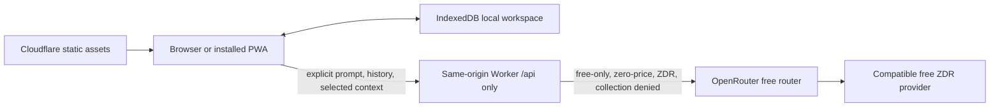

# CALIPAR PWA Demo Handoff

Updated: 2026-07-31 (America/Los_Angeles), revised same day after the WebKit
editor-opening diagnosis and the workspace-seam work.

## Executive status

The standalone CALIPAR PWA demo is substantially implemented and the core
local-first architecture is working. It builds as a static Next.js application,
generates an installable Serwist service worker, persists synthetic workspace
data in IndexedDB, exposes no login requirement, and includes a same-origin
Cloudflare Worker that constrains OpenRouter requests to a free/privacy policy.

It is **not release-ready and has not been proven deployed**. Current blockers
are:

1. Five serious/critical axe failures across the landing page, dashboard,
   reviews, chat, and settings.
2. Lighthouse recommended-audit and accessibility failures on `/` and
   `/dashboard/`.
3. ~~One WebKit editor-opening timing failure.~~ **Resolved.** It was not a
   flake. `ReviewEditor` latched its copy of the review at mount
   (`useState(() => source ?? null)`) and never re-read it, so when navigation
   landed on the editor before the workspace snapshot was ready the component
   stayed on “Opening review…” permanently. Fixed by deriving the review rather
   than latching it. The full E2E suite now passes 37/37 with 5 skipped. See
   “WebKit editor-opening race” below.
4. Codex Security scan `a68f98b4-8e52-4630-96b2-90a25ee518ec` is still running
   in reporting at 8/15 artifacts. Its six findings are not sealed and no final
   `report.md` exists.
5. No authenticated Cloudflare preview, live OpenRouter canary, promotion, or
   production smoke test has been completed or verified in this handoff.

Do not describe this build as launched, production-ready, fully accessible, or
security-cleared until those gates are closed with fresh evidence.

## Repository and scope boundary

Work only in:

```text
/Users/laccd/code/calipar/calipar_pwa_demo
```

This is intentionally separate from the parent production CALIPAR stack. It
does not use or weaken Firebase authentication, FastAPI, PostgreSQL, production
demo-mode data separation, or the existing Gemini integration.

Git state:

- The directory has no nested `.git` repository; it is tracked in the parent
  repository at `/Users/laccd/code/calipar`.
- The package was first committed on 2026-07-31 on branch
  `feat/pwa-demo-workspace-seam`, off parent HEAD
  `ddb6070cec7869ce0f6ff3ff8baa5c37544dfcc1`. Before that commit the whole
  directory was untracked, so there is no per-file history earlier than it.
- Generated output is excluded by the nested `.gitignore`: `node_modules/`,
  `.next/`, `out/`, `.wrangler/`, `.lighthouseci/`, `test-results/`,
  `playwright-report/`, `.dev.vars`, and local workspace exports.
- `openrouter-llms-full.txt` is a 3.5 MB local reference dump. It was already
  excluded from asset uploads by `.assetsignore`, `serwist.config.js` and
  `scripts/verify/artifacts.mjs`; it is now also gitignored, so it is **not** in
  history. Re-download it rather than committing it.

## Product behavior implemented

The public landing page leads directly into a synthetic Demo Program Review
Lead workspace. There is no authentication screen or role selector.

Implemented application routes:

| Route | Purpose |
| --- | --- |
| `/` | Public landing page, product/privacy framing, demo entry |
| `/dashboard/` | Repository-derived review horizon and activity summary |
| `/reviews/` | Local review portfolio |
| `/reviews/new/` | Create a browser-local review |
| `/reviews/editor/?id=<id>` | Static route for editing an IndexedDB-created review |
| `/data/` | Aggregate synthetic outcomes and accessible tables |
| `/planning/` | Local action-plan workflows |
| `/resources/` | Local resource-request workflows |
| `/activity/` | Transaction-generated activity history |
| `/chat/` | Mission-Bot disclosure, selected context, local history, AI UI |
| `/settings/` | Preferences, workspace export/import/reset |
| `/offline/` | Offline fallback/status page |

Important data behavior:

- IndexedDB database name: `calipar-demo`.
- Domain and activity changes use repository transactions.
- Seed data is deterministic and synthetic.
- Reset flushes/clears/reseeds domain and chat data while preserving intended
  lightweight preferences.
- Export is versioned, unencrypted JSON.
- Import is replace-only, validates references and schema versions, sanitizes
  text, offers a pre-import backup, and is expected to be atomic on failure.
- `BroadcastChannel` notifies same-origin tabs after committed changes.
- The service worker precaches static application routes/assets; `/api/*` is
  network-only and AI requests are not queued offline.

## Architecture and trust boundaries



Cloudflare configuration uses one Worker with Static Assets:

- Worker entry: `worker/index.ts`
- Static export: `out/`
- Worker-first routes: `/api/*` only
- No D1, KV, R2, Durable Objects, server-side application database, queue, or
  scheduled data reset
- Rate-limit binding: five AI task requests per 60 seconds
- Static routes bypass Worker invocation

The Worker owns the upstream request. The browser cannot select a model,
provider, URL, tool, price, token limit, or privacy relaxation. Intended
provider policy includes `model: "openrouter/free"`, zero maximum prices,
zero-data-retention routing, provider data collection denied, and free-only
fallback. A short-lived signed `HttpOnly`, `Secure`, `SameSite=Strict` cookie
is minted after Turnstile verification.

The privacy statement must remain precise: the workspace is local, but a user
who invokes AI sends the prompt, included conversation history, and selected
context through Cloudflare to OpenRouter and a routed provider. Never claim
that AI inputs remain entirely on-device.

## Important code and documentation

| Area | Paths |
| --- | --- |
| App shell/routes | `app/`, `components/app-shell.tsx` |
| Workspace seam | `components/workspace-provider.tsx` — `WorkspaceStateProvider` is the presenter that owns the private context; `WorkspaceProvider` is the IndexedDB-backed adapter around it. `useWorkspace()` is the only read interface. Tests supply state through `WorkspaceStateProvider` and never mock the module path. |
| Component test fixtures | `tests/support/workspace-fixture.ts` — typed builders for `WorkspaceData`, `WorkspaceDerivations` and the three workspace states |
| Review editor/autosave | `components/review-editor.tsx`, `app/(demo)/reviews/editor/page.tsx` |
| Browser persistence | `lib/db/database.ts`, `lib/db/repository.ts` |
| Domain contracts/derivations | `lib/domain/`, `lib/seed/data.ts` |
| Import sanitization | `lib/utils/sanitize.ts` |
| Browser AI client/contracts | `lib/ai/client.ts`, `lib/ai/contracts.ts` |
| Worker AI/session/SSE logic | `worker/index.ts` |
| PWA | `app/manifest.ts`, `app/sw.ts`, `serwist.config.js`, `public/icons/` |
| Cloudflare config/scripts | `wrangler.jsonc`, `scripts/cloudflare/` |
| Artifact/security checks | `scripts/verify/`, `.assetsignore`, `public/.assetsignore` |
| Tests | `tests/unit/`, `tests/worker/`, `tests/e2e/`, `tests/a11y/` |
| Architecture/privacy/release docs | `docs/ARCHITECTURE.md`, `docs/PRIVACY_AND_AI.md`, `docs/TESTING.md`, `docs/CLOUDFLARE_DEPLOY.md` |
| Session handoffs | `docs/handoffs/` — carry-over context for continuing work. Newest: `2026-07-31-workspace-seam.md` |
| Architecture reviews | `docs/architecture-reviews/` — deepening candidates with before/after diagrams. Newest: `2026-07-31-deepening-candidates.html`; candidates 2, 4 and 5 are still open |

Package versions are pinned in `package.json` and `package-lock.json`. At this
handoff, the lockfile SHA-1 is
`19536eb6314ed8a08b8767ebbe145aa292484f7f`.

## Verification performed for this handoff

Environment:

```text
Node.js v22.23.0
npm 10.9.8
Next.js 16.2.12
Wrangler 4.115.0
```

The package permits Node 20.9 through 22.x. CI is configured for Node 20, so a
clean Node 20 run is still required before release even though the local Node
22 checks below are valid development evidence.

| Check | Current result |
| --- | --- |
| `npm run typecheck` | Pass |
| `npm run lint` | Pass, zero warnings |
| `npm run test:unit` | Pass: 9 files, 58 tests |
| Unit coverage, `lib/**` | 92.85% statements, 91.91% branches, 92.42% functions, 93.02% lines |
| Unit coverage, `components/**` | 28.11% statements, 31.92% branches, 26.15% functions, 29.68% lines |
| `npm run test:worker` | Pass: 1 file, 29 tests |
| Worker coverage | 92.41% statements, 86.10% branches, 96.55% functions, 93.57% lines |
| `npm run build` | Pass: 15 static pages; Serwist precached 51 URLs totaling 1.47 MB |
| `npm run verify:artifacts` | Pass: 156 exported assets; manifest digest `d62c4f88c6966002` |
| `npm run cloudflare:limits` | Pass: 156 assets, 1,779,381 bytes, within static Free limits |
| `npm run cloudflare:dry-run` | Pass: Worker upload 34.71 KiB / gzip 8.96 KiB (9,291 bytes), no upload |
| `npm run test:e2e` | Pass: 37 passed, 5 skipped, 0 failures |
| `npm run test:a11y` | Fail: 6 passed, 5 failed |
| `npm run test:lighthouse` | Fail on both collected URLs |

### WebKit editor-opening race — resolved

The failure was:

```text
[webkit] tests/e2e/review-persistence.spec.ts
creates, autosaves, reloads, and submits a local review
```

After navigation to the new editor URL the page remained at `Opening review…`
and `data-testid="review-editor"` never appeared. It presented as a flake
because it needed contention to reproduce — roughly 1-in-10 under the standard
two-worker run, and green on a focused rerun.

**Root cause.** `components/review-editor.tsx` initialised its copy of the
review once, at mount, from the workspace snapshot and never re-read it. When
navigation landed on the editor before `WorkspaceProvider` had refreshed, that
initial read found nothing and the component's own recovery branch could not
fire: it required `state.status === "ready" && !source`, but once the snapshot
arrived `source` was truthy, so the render fell through to `Opening review…`
**permanently**. Not a slow load — a deadlock.

**Fix.** Derive the review instead of latching it, so a late snapshot still
opens the editor while unsaved local edits keep precedence:

```ts
const [draft, setDraft] = useState<ReviewRecord | null>(null);
const review = draft ?? source ?? null;
```

An earlier attempt used a `useEffect` to sync the value; it worked but tripped
`react-hooks/set-state-in-effect` against the zero-warning lint gate. Deriving
removes the failure mode rather than patching it.

**The same defect existed a second time** at `app/(demo)/reviews/new/page.tsx`,
where `useState(programs[0]?.id ?? "")` latched the program to `""` on a
non-ready first render — papered over by `|| programs[0]?.id || ""` fallbacks at
the submit handler and the `<select>`. Also fixed by deriving; both fallbacks
removed.

**Regression cover.** `tests/unit/review-editor-mount.test.tsx` and
`tests/unit/reviews-new-latch.test.tsx` reproduce the mount ordering
deterministically in about a second, with no browser and no IndexedDB. Both were
verified red against the reverted fixes.

Note for whoever tests this next: a non-`multiple` `<select>` reports its first
option's value when nothing matches, so asserting on the rendered select value
cannot distinguish the latched case from the derived one. Assert on what the
submit handler passes to `createReview` instead.

### Accessibility failures

The axe gate found five material failures:

| Route | Violation and current selectors |
| --- | --- |
| `/` | `color-contrast`: `.button-coral`, `.chart-note > span`, `#privacy > div:nth-child(1) > .eyebrow` |
| `/dashboard/` | `color-contrast`: `.draft` |
| `/reviews/` | `color-contrast`: `.draft` |
| `/chat/` | `color-contrast`: `.chat-context > p:nth-child(3)` and the three context-list `small` elements |
| `/settings/` | Critical `label`: hidden import file `input[data-testid="settings-import"]` has no accessible label |

Fix the design token/selector rules rather than suppressing axe. The settings
file input needs an explicit accessible name connected to the visible import
control. Recalculate contrast after changing foreground/background tokens; the
chat failure measured `#61737a` on `#eef2ed` at 4.37:1, below the required
4.5:1 for the small normal text used there.

### Lighthouse failures

`npm run test:lighthouse` collected two runs each for `/` and `/dashboard/`.
The recommended preset failed both URLs for contrast, Chrome inspector issues,
legacy-JavaScript insight, network-dependency-tree insight, and two unused
JavaScript findings. `/dashboard/` also failed accessible-name/visible-label
matching. Performance warnings included time-to-interactive, LCP,
render-blocking resources, and legacy JavaScript.

The configured category budgets remain performance 0.80, accessibility 0.95,
best practices 0.90, and SEO 0.90. Fix the axe/label issues first, then inspect
the generated reports under `test-results/lighthouse/`. Do not loosen the
recommended preset or category budgets merely to get a passing result; if a
new Lighthouse audit is incompatible with the pinned toolchain, document and
justify a narrowly scoped configuration change.

Generated evidence is under `test-results/` and is gitignored.

## Codex Security scan handoff

Authoritative scan:

```text
scanId: a68f98b4-8e52-4630-96b2-90a25ee518ec
mode: standard
status: running
phase: reporting
progress: 8 / 15 report artifacts
scope: whole calipar_pwa_demo target
target revision: ddb6070cec7869ce0f6ff3ff8baa5c37544dfcc1
required snapshot digest:
codex-security-snapshot/v1:sha256:221dcf160bc9020f3e9e05b0a303ff630498b284f3211755428e10ac57c8399e
```

The exact security focus supplied for the scan was:

> Focus on imported local workspace data/XSS, browser storage boundaries, API
> key secrecy, same-origin/session/Turnstile abuse controls, OpenRouter
> free-only enforcement, SSE handling, cache/privacy behavior, and deploy
> artifact secret leakage.

Current phase evidence:

- Preflight: 4/4 checks completed, ready.
- Discovery coverage: 99/99 original in-scope files reviewed.
- Validation and compact attack-path analysis are complete.
- Six candidates survived as reportable findings.
- Canonical draft `scan-manifest.json`, `findings.json`, and `coverage.json`
  were assembled and JSON-syntax checked in the scan workspace.
- Four finding write-ups and PoC/support bundles exist.
- Two required write-ups remain missing.
- The user explicitly authorized a main-agent fallback for those two reports
  after the dedicated write-up workers repeatedly hit a platform safety filter.
- Completion has not been called. The scan has not been failed or canceled.

The current scan workspace is an OS-temporary path and may not survive a reboot:

```text
/private/var/folders/w1/wdjldgtj6zjfwzb1wh_6l56m0000gq/T/
codex-security-scans-MvVrU3/calipar_pwa_demo/
ddb6070cec7869ce0f6ff3ff8baa5c37544dfcc1_20260730T050758Z_eqmvolaa
```

Join those wrapped lines into one path when using it. Do not copy the scan's
handoff claim token, provider credentials, or cookies into this repository.
Load the authoritative scan context through the Codex Security tool before
continuing, and stop if it is no longer `running`.

### Reportable findings

| Severity | Finding | Primary remediation direction |
| --- | --- | --- |
| Medium | Mission-Bot retransmits browser-local chat history without disclosing it | Make history transmission explicit, bounded, and accurately disclosed |
| Medium | Public AI session route buffers oversized bodies before rejecting them | Enforce the 64 KiB limit incrementally before full buffering |
| Medium | Fresh Turnstile sessions reset the AI rate-limit identity | Bind abuse limits to a stable edge/client dimension and limit session minting |
| Low | Preview upload does not enforce content-based secret scanning | Run the content scanner inside the upload gate, not as an optional sibling check |
| Low | AI stream output is unbounded across Worker and browser | Cap aggregate SSE bytes/events, cancel upstream, and bound browser accumulation |
| Low | Structured AI responses are fully buffered without output limits | Bound upstream bytes, strings, arrays, and aggregate serialized output |

Existing completed write-ups:

1. `chat-history-retransmission`
2. `ai-session-rate-limit-reset`
3. `preview-artifact-secret-scan`
4. `unbounded-ai-stream-output`

Missing write-ups authorized for direct main-agent completion:

1. `request-body-prebuffering/request-body-prebuffering.md` plus a regular
   supporting file in its sibling `poc/` directory.
2. `unbounded-structured-ai-output/unbounded-structured-ai-output.md`; a
   partial test file exists, but the report and a verified portable PoC bundle
   still need to be finished.

### Snapshot/finalization hazard

The Codex Security finalizer validates the live target against the required
snapshot digest immediately before sealing. The live tree had already diverged
from the scanned snapshot in seven small post-snapshot test/UI fixes. This new
`AGENTS.md` and `HANDOFF.md` add two more files, so the old recorded live digest
must now be treated as stale.

The scan workspace contains
`artifacts/04_reporting/post_snapshot_changes.patch`, but it predates these two
handoff files and covers only the previously known seven edits. Do not assume
that patch alone can restore the current tree after temporary snapshot work.

Before finalization:

1. Back up every current live-tree difference, including `AGENTS.md` and
   `HANDOFF.md`, without exposing secrets.
2. Finish and review all six write-ups and PoC directories.
3. Prevalidate the unsealed canonical bundle with the plugin's read-only
   finalization preparation routine. Confirm write-up paths, evidence refs,
   coverage receipts, schemas, and regular-file checks.
4. Update reporting progress only for artifacts that exist and pass checks.
5. Temporarily make the live target match the required digest exactly.
6. Call `complete_codex_security_scan` once. Do not create `report.md` by hand;
   the finalizer owns it.
7. If completion fails, surface the exact error and do not retry completion in
   the same response.
8. After successful completion, restore every post-snapshot live-tree change,
   including these handoff files.
9. Verify the sealed manifest has `scan.sealedAt` and `scan.artifacts`, verify
   generated `report.md`, run the sealed contract validator, and confirm the
   live workspace was restored.

Starting a new scan of the current tree would avoid the snapshot mismatch but
would not complete the specifically requested scan ID. Do not abandon, fail,
cancel, or replace the running scan without explicit user direction.

## Prioritized next work

### P0: make the release gate honest and green

1. Fix the five axe failures listed above.
2. Rerun `npm run test:a11y` and verify all 11 tests pass.
3. ~~Diagnose the WebKit editor-opening race.~~ Done — see above. The full E2E
   matrix passes 37/37 with 5 skipped.
4. Rerun Lighthouse and address accessibility/name, JavaScript, and critical
   rendering findings without weakening budgets.
5. Rerun `npm run verify:full` from a clean build under Node 20.

Measure E2E on an unloaded machine. During the diagnosis above, three
consecutive runs produced contradictory failure rates (10%, 33%, 100%) purely
because host load reached 48; the same suite was clean at load 7. Check
`uptime` before trusting an E2E verdict, and treat `--workers` above the
configured 2 as invalid — it starves workerd and manufactures failures that
look like application bugs.

### P0: complete the running security scan

Use the main-agent fallback authorization to finish the two reports, validate
all six packages, prevalidate canonical JSON, handle the snapshot mismatch
safely, finalize once, restore the current worktree, and run the sealed bundle
validator. Do not report the findings as final or attach final scan outputs
until completion succeeds.

### P1: first Git integration

Review the untracked directory as a new package. Exclude generated files and
secret-bearing local config. The nested workflow is only a template; if CI
integration is approved, move/copy it into the parent repository's root
`.github/workflows/` location while keeping all commands scoped to
`calipar_pwa_demo/`.

### P1: Cloudflare preview and live AI validation

Only after local gates and the security scan are complete:

1. Confirm the exact Cloudflare account, Workers Free plan, and Worker-name
   ownership with authenticated Wrangler.
2. Create dedicated OpenRouter and Worker secrets interactively; never place
   values in source or command arguments.
3. Upload an immutable preview without changing production traffic.
4. Test the exact returned preview URL: routes, headers, manifest, service
   worker, offline behavior, Cache Storage, and API errors.
5. Run one bounded streaming chat and one structured live AI canary with a
   fresh Turnstile-backed session. Confirm the selected model is free and no
   cost is reported when usage cost is available.
6. Promote only the exact tested version ID, then perform production smoke
   tests and retain the previous verified rollback version ID.

## Secrets and deployment state

No real secret value is recorded in this handoff. Required bindings are:

```text
OPENROUTER_API_KEY
AI_SESSION_SECRET
TURNSTILE_SECRET_KEY
TURNSTILE_SITE_KEY
```

`TURNSTILE_SITE_KEY` is public at runtime but deployment-specific and is kept
out of source. `.dev.vars` is gitignored. The current successful Wrangler check
was a local dry run only; it did not upload or deploy anything.

No preview URL, Worker version UUID, production URL, live model response,
Cloudflare account confirmation, or rollback version is available in this
handoff. Do not invent any of them.

## Definition of done

The PWA demo is ready to hand to users only when all of the following are
evidenced for the same source snapshot:

- The directory is reviewed and intentionally tracked in Git.
- `npm ci` and `npm run verify:full` pass under the release Node version.
- Axe has no serious or critical findings on included routes.
- Lighthouse budgets pass without unjustified suppressions.
- The Codex Security scan is sealed and its report reviewed; material findings
  are fixed or explicitly accepted with rationale.
- Artifact scanning confirms no secrets or excluded reference files in `out/`.
- An immutable Cloudflare preview is tested at the exact returned URL.
- The bounded live AI canary confirms free-only/privacy-compatible routing or
  reports capacity unavailable without falling back to paid service.
- The exact tested Worker version is promoted and production routes/PWA/API
  are smoke-tested.
- A previous verified version ID is retained for rollback.

Until then, the accurate status is: **implemented local-first demo with strong
core tests, but accessibility, Lighthouse, security finalization, and live
deployment verification remain open**.
