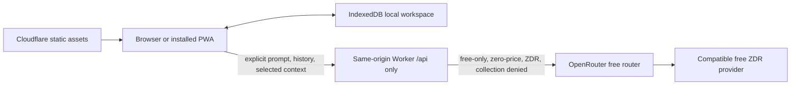

# CALIPAR PWA Demo Handoff

Updated: 2026-08-04 (America/Los_Angeles). Previously 2026-08-03, which recorded
the accessibility-contrast fixes, and 2026-07-31, revised that day after the
WebKit editor-opening diagnosis and the workspace-seam work. This revision
re-measured the local gates, corrected the stale verification table, and brought
the Git-state and security-snapshot sections up to the current tree.

## Executive status

The standalone CALIPAR PWA demo is substantially implemented and the core
local-first architecture is working. It builds as a static Next.js application,
generates an installable Serwist service worker, persists synthetic workspace
data in IndexedDB, exposes no login requirement, and includes a same-origin
Cloudflare Worker that constrains OpenRouter requests to a free/privacy policy.

It is **not release-ready and has not been proven deployed**. Current blockers
are:

1. ~~Five serious/critical axe failures across the landing page, dashboard,
   reviews, chat, and settings.~~ **Resolved 2026-08-03.** Four were
   `color-contrast` misses between 4.15:1 and 4.48:1, fixed by retuning three
   text-bearing design tokens and moving the coral CTA to a deeper fill; the
   critical one was an unlabeled settings file input. `npm run test:a11y` now
   passes 11/11. See “Accessibility failures — resolved” below.
2. Lighthouse `lhci autorun` still exits 1 on `/` and `/dashboard/`. **Narrowed
   2026-08-03**: all four category budgets now pass and accessibility scores
   1.00 on both URLs; what remains are per-audit `lighthouse:recommended`
   failures — JavaScript payload, render blocking, request-chain depth, a CSP
   inspector issue — plus one genuine WCAG 2.5.3 brand-link defect that the axe
   suite is currently blind to.
3. ~~One WebKit editor-opening timing failure.~~ **Resolved.** It was not a
   flake. `ReviewEditor` latched its copy of the review at mount
   (`useState(() => source ?? null)`) and never re-read it, so when navigation
   landed on the editor before the workspace snapshot was ready the component
   stayed on “Opening review…” permanently. Fixed by deriving the review rather
   than latching it. The full E2E suite now passes 37/37 with 5 skipped. See
   “WebKit editor-opening race” below.
4. Codex Security scan `a68f98b4-8e52-4630-96b2-90a25ee518ec` was last observed
   on 2026-07-30 running in reporting at 8/15 artifacts. Its six findings are
   not sealed and no final `report.md` exists. That observation is now several
   days old, its workspace is an OS-temporary path, and the live tree has moved
   substantially since the scanned snapshot — re-confirm the scan is alive
   before acting on any of it. See “Snapshot/finalization hazard”.
5. No authenticated Cloudflare preview, live OpenRouter canary, promotion, or
   production smoke test has been completed or verified in this handoff.

Do not describe this build as launched, production-ready, fully accessible, or
security-cleared until those gates are closed with fresh evidence.

## Repository and scope boundary

Work only in:

```text
/Users/laccd/code/calipar/calipar_pwa_demo
```

This is intentionally separate from the parent production CALIPAR stack. It
does not use or weaken Firebase authentication, FastAPI, PostgreSQL, production
demo-mode data separation, or the existing Gemini integration.

Git state:

- The directory has no nested `.git` repository; it is tracked in the parent
  repository at `/Users/laccd/code/calipar`.
- The package **is tracked**, on branch `feat/pwa-demo-workspace-seam`. It was
  first committed on 2026-07-31 in `c5d1518 feat: track the CALIPAR PWA demo
  package`, off parent HEAD `ddb6070cec7869ce0f6ff3ff8baa5c37544dfcc1`. Before
  that commit the whole directory was untracked, so there is no per-file history
  earlier than it.
- Commits since, oldest first: `16ec12d` gitignore the local issue tracker,
  `5a42aa0` session handoff and architecture review, `8dff02c` domain glossary
  and ADRs 0001–0003, `5580d23` rename `getWorkspaceSnapshot` to `readWorkspace`,
  `32ab983` derive the workspace from one reading, `746c876` one definition each
  for the workspace derivations.
- The 2026-08-03 accessibility fixes were committed on 2026-08-04 together with
  this revision; before that they existed only in the working tree, so any
  earlier clone of this branch does **not** contain them.
- Generated output is excluded by the nested `.gitignore`: `node_modules/`,
  `.next/`, `out/`, `.wrangler/`, `.lighthouseci/`, `test-results/`,
  `playwright-report/`, `.dev.vars`, and local workspace exports.
- `openrouter-llms-full.txt` is a 3.5 MB local reference dump. It was already
  excluded from asset uploads by `.assetsignore`, `serwist.config.js` and
  `scripts/verify/artifacts.mjs`; it is now also gitignored, so it is **not** in
  history. Re-download it rather than committing it.

## Product behavior implemented

The public landing page leads directly into a synthetic Demo Program Review
Lead workspace. There is no authentication screen or role selector.

Implemented application routes:

| Route | Purpose |
| --- | --- |
| `/` | Public landing page, product/privacy framing, demo entry |
| `/dashboard/` | Repository-derived review horizon and activity summary |
| `/reviews/` | Local review portfolio |
| `/reviews/new/` | Create a browser-local review |
| `/reviews/editor/?id=<id>` | Static route for editing an IndexedDB-created review |
| `/data/` | Aggregate synthetic outcomes and accessible tables |
| `/planning/` | Local action-plan workflows |
| `/resources/` | Local resource-request workflows |
| `/activity/` | Transaction-generated activity history |
| `/chat/` | Mission-Bot disclosure, selected context, local history, AI UI |
| `/settings/` | Preferences, workspace export/import/reset |
| `/offline/` | Offline fallback/status page |

Important data behavior:

- IndexedDB database name: `calipar-demo`.
- Domain and activity changes use repository transactions.
- Seed data is deterministic and synthetic.
- Reset flushes/clears/reseeds domain and chat data while preserving intended
  lightweight preferences.
- Export is versioned, unencrypted JSON.
- Import is replace-only, validates references and schema versions, sanitizes
  text, offers a pre-import backup, and is expected to be atomic on failure.
- `BroadcastChannel` notifies same-origin tabs after committed changes.
- The service worker precaches static application routes/assets; `/api/*` is
  network-only and AI requests are not queued offline.

## Architecture and trust boundaries



Cloudflare configuration uses one Worker with Static Assets:

- Worker entry: `worker/index.ts`
- Static export: `out/`
- Worker-first routes: `/api/*` only
- No D1, KV, R2, Durable Objects, server-side application database, queue, or
  scheduled data reset
- Rate-limit binding: five AI task requests per 60 seconds
- Static routes bypass Worker invocation

The Worker owns the upstream request. The browser cannot select a model,
provider, URL, tool, price, token limit, or privacy relaxation. Intended
provider policy includes `model: "openrouter/free"`, zero maximum prices,
zero-data-retention routing, provider data collection denied, and free-only
fallback. A short-lived signed `HttpOnly`, `Secure`, `SameSite=Strict` cookie
is minted after Turnstile verification.

The privacy statement must remain precise: the workspace is local, but a user
who invokes AI sends the prompt, included conversation history, and selected
context through Cloudflare to OpenRouter and a routed provider. Never claim
that AI inputs remain entirely on-device.

## Important code and documentation

| Area | Paths |
| --- | --- |
| App shell/routes | `app/`, `components/app-shell.tsx` |
| Workspace seam | `components/workspace-provider.tsx` — `WorkspaceStateProvider` is the presenter that owns the private context; `WorkspaceProvider` is the IndexedDB-backed adapter around it. `useWorkspace()` is the only read interface. Tests supply state through `WorkspaceStateProvider` and never mock the module path. |
| Component test fixtures | `tests/support/workspace-fixture.ts` — typed builders for `WorkspaceData`, `WorkspaceDerivations` and the three workspace states |
| Review editor/autosave | `components/review-editor.tsx`, `app/(demo)/reviews/editor/page.tsx` |
| Browser persistence | `lib/db/database.ts`, `lib/db/repository.ts` |
| Domain contracts/derivations | `lib/domain/`, `lib/seed/data.ts` |
| Import sanitization | `lib/utils/sanitize.ts` |
| Browser AI client/contracts | `lib/ai/client.ts`, `lib/ai/contracts.ts` |
| Worker AI/session/SSE logic | `worker/index.ts` |
| PWA | `app/manifest.ts`, `app/sw.ts`, `serwist.config.js`, `public/icons/` |
| Cloudflare config/scripts | `wrangler.jsonc`, `scripts/cloudflare/` |
| Artifact/security checks | `scripts/verify/`, `.assetsignore`, `public/.assetsignore` |
| Tests | `tests/unit/`, `tests/worker/`, `tests/e2e/`, `tests/a11y/` |
| Domain vocabulary and decisions | `CONTEXT.md` — the ubiquitous language for the workspace, derivations and activity; `docs/adr/0001`–`0003` — why derivations read the workspace once, fill the existing workspace slot, and carry their counts. Read these before changing `lib/domain/` or `components/workspace-provider.tsx` |
| Architecture/privacy/release docs | `docs/ARCHITECTURE.md`, `docs/PRIVACY_AND_AI.md`, `docs/TESTING.md`, `docs/CLOUDFLARE_DEPLOY.md` |
| Session handoffs | `docs/handoffs/` — carry-over context for continuing work. Newest: `2026-07-31-workspace-seam.md`. The 2026-08-03 accessibility session has no handoff of its own; its record is the “Accessibility failures — resolved” section below |
| Implementation plans | `docs/plans/` — task-by-task plans for work not yet done. Newest: `2026-08-04-public-beta-readiness.md`, the route from here to an unlisted public beta |
| Architecture reviews | `docs/architecture-reviews/` — deepening candidates with before/after diagrams. Newest: `2026-07-31-deepening-candidates.html`; candidates 2, 4 and 5 are still open |

Package versions are pinned in `package.json` and `package-lock.json`. At this
handoff, the lockfile SHA-1 is
`19536eb6314ed8a08b8767ebbe145aa292484f7f`.

## Verification performed for this handoff

Environment:

```text
Node.js v22.23.0
npm 10.9.8
Next.js 16.2.12
Wrangler 4.115.0
```

The package permits Node 20.9 through 22.x. CI is configured for Node 20, so a
clean Node 20 run is still required before release even though the local Node
22 checks below are valid development evidence.

Two dates appear below. **Re-measured 2026-08-04** means the command was run
against the current tree for this revision. **2026-08-03** means the result is
carried over from the previous revision and has not been re-run since; the
browser and build suites need a quiet host, so they were left alone.

| Check | Current result | Measured |
| --- | --- | --- |
| `npm run typecheck` | Pass | 2026-08-04 |
| `npm run lint` | Pass, zero warnings | 2026-08-04 |
| `npm run test:unit` | Pass: 11 files, 75 tests | 2026-08-04 |
| Unit coverage, `lib/**` | 93.16% statements, 89.40% branches, 93.20% functions, 93.92% lines. Gate: 85 statements, 80 branches, 85 functions, 85 lines | 2026-08-04 |
| Unit coverage, `components/**` | 36.86% statements, 42.54% branches, 32.84% functions, 39.56% lines. Gate: 25 statements, 28 branches, 25 functions, 27 lines | 2026-08-04 |
| `npm run test:worker` | Pass: 1 file, 29 tests | 2026-08-04 |
| Worker coverage | 92.41% statements, 86.10% branches, 96.55% functions, 93.57% lines | 2026-08-04 |
| `npm run build` | Pass: 15 static pages; Serwist precached 51 URLs totaling 1.47 MB | 2026-08-03 |
| `npm run verify:artifacts` | Pass: 156 exported assets; manifest digest `d62c4f88c6966002` | 2026-08-03 |
| `npm run cloudflare:limits` | Pass: 156 assets, 1,779,381 bytes, within static Free limits | 2026-08-03 |
| `npm run cloudflare:dry-run` | Pass: Worker upload 34.71 KiB / gzip 8.96 KiB (9,291 bytes), no upload | 2026-08-03 |
| `npm run test:e2e` | Pass: 37 passed, 5 skipped, 0 failures | 2026-08-03 |
| `npm run test:a11y` | Pass: 11 passed (was 6 passed, 5 failed) | 2026-08-03 |
| `npm run test:lighthouse` | Fail on both collected URLs | 2026-08-03 |

Both coverage rows are aggregates over the configured glob in `vitest.config.ts`,
which excludes `lib/seed/**`, `lib/domain/types.ts`, and the icon components. The
`components/**` floor is set deliberately just under the real number to stop the
layer regressing to unmeasured; ratchet it up as `modal.tsx` and `pwa-bridge.tsx`
gain tests. Quote these numbers from a fresh run, not from this table — an
earlier revision carried a unit row that disagreed with its own prose.

### WebKit editor-opening race — resolved

The failure was:

```text
[webkit] tests/e2e/review-persistence.spec.ts
creates, autosaves, reloads, and submits a local review
```

After navigation to the new editor URL the page remained at `Opening review…`
and `data-testid="review-editor"` never appeared. It presented as a flake
because it needed contention to reproduce — roughly 1-in-10 under the standard
two-worker run, and green on a focused rerun.

**Root cause.** `components/review-editor.tsx` initialised its copy of the
review once, at mount, from the workspace snapshot and never re-read it. When
navigation landed on the editor before `WorkspaceProvider` had refreshed, that
initial read found nothing and the component's own recovery branch could not
fire: it required `state.status === "ready" && !source`, but once the snapshot
arrived `source` was truthy, so the render fell through to `Opening review…`
**permanently**. Not a slow load — a deadlock.

**Fix.** Derive the review instead of latching it, so a late snapshot still
opens the editor while unsaved local edits keep precedence:

```ts
const [draft, setDraft] = useState<ReviewRecord | null>(null);
const review = draft ?? source ?? null;
```

An earlier attempt used a `useEffect` to sync the value; it worked but tripped
`react-hooks/set-state-in-effect` against the zero-warning lint gate. Deriving
removes the failure mode rather than patching it.

**The same defect existed a second time** at `app/(demo)/reviews/new/page.tsx`,
where `useState(programs[0]?.id ?? "")` latched the program to `""` on a
non-ready first render — papered over by `|| programs[0]?.id || ""` fallbacks at
the submit handler and the `<select>`. Also fixed by deriving; both fallbacks
removed.

**Regression cover.** `tests/unit/review-editor-mount.test.tsx` and
`tests/unit/reviews-new-latch.test.tsx` reproduce the mount ordering
deterministically in about a second, with no browser and no IndexedDB. Both were
verified red against the reverted fixes.

Note for whoever tests this next: a non-`multiple` `<select>` reports its first
option's value when nothing matches, so asserting on the rendered select value
cannot distinguish the latched case from the derived one. Assert on what the
submit handler passes to `createReview` instead.

### Accessibility failures — resolved

The axe gate found five material failures, across nine nodes:

| Route | Violation and selectors |
| --- | --- |
| `/` | `color-contrast`: `.button-coral`, `.chart-note > span`, `#privacy > div:nth-child(1) > .eyebrow` |
| `/dashboard/` | `color-contrast`: `.draft` |
| `/reviews/` | `color-contrast`: `.draft` |
| `/chat/` | `color-contrast`: `.chat-context > p:nth-child(3)` and the three context-list `small` elements |
| `/settings/` | Critical `label`: hidden import file `input[data-testid="settings-import"]` has no accessible label |

All were fixed at the token and markup level; nothing was suppressed and no
axe rule or tag was narrowed.

**Contrast.** Four of the five were one root cause each — a token carrying small
text at 7–11px on a light surface. Values were taken from axe's own
`failureSummary` rather than derived by hand, because several of the surfaces
are composited (`rgba` over a card over the page background) and hand-computed
backdrops would have been wrong. Each replacement is a hue-preserving darkening
targeting roughly 4.75:1, so none of them sits on the 4.5 line:

| Token | Was | Now | Worst pair it must clear |
| --- | --- | --- | --- |
| `--sea` | `#0b6e75` | `#0b6970` | 4.48 → 4.80 on `--sea-light` `#c7e5df` |
| `--muted` | `#61737a` | `#5b6c73` | 4.37 → 4.77 on `.chat-context` `#eef2ed` |
| `--warning` | `#9c641f` | `#8f5c1c` | 4.15 → 4.76 on the draft pill `#f7ead6` |
| `--coral-dark` | `#c64f3d` | `#b94f3c` | white text 3.22 → 4.95 (see below) |

`--sea` has 55 usages and `--muted` 54, so before changing either, every backdrop
each one lands on was checked, not just the failing one. Both are used only as
foreground-on-light or as a background behind white text, and darkening improves
*both* roles — white on `--sea` went 6.00 → 6.42. The status pills that were
already passing keep headroom: `success` 4.75, `in-review` 5.66, `declined` 5.57.

**The coral CTA is a deliberate visible change.** White on `--coral` `#e96752`
measured 3.22:1, and `--ink` on `--coral` is only 4.36:1, so no text colour
rescues the bright fill — the fill itself had to deepen. `.button-coral` now
takes `--coral-dark`, with a new `--coral-deep` `#a3452f` for hover. **`--coral`
itself is unchanged**, because it is the right colour for the ~15 decorative
rules, progress bars and dots that carry no text and therefore have no contrast
obligation. The original bright-coral `box-shadow` is kept, so the button still
reads as a coral CTA rather than a muddy brick. `.button-coral` was verified to
be the only text-bearing coral surface; `.hero-eyebrow span` is a 30×1px rule
and `.send-button.stop span` is a 10×10px glyph on a button that already carries
`aria-label="Stop generation"`.

A comment above the three text-bearing tokens in `styles/globals.css` records
that they are contrast-tuned. **Lightening any of them re-breaks `tests/a11y`** —
recompute before changing.

**The critical failure** was the `sr-only` file input at
`app/(demo)/settings/page.tsx`. It now has an `sr-only` `<label htmlFor>` rather
than an `aria-label`, so the accessible name is a real label element that
survives refactors and stays visible to translation tooling. `.sr-only` is
absolutely positioned, so the added label does not disturb the flex row.

**Result:** `npm run test:a11y` passes 11/11, was 6 passed / 5 failed. The rest
of the suite is unchanged: e2e 37 passed / 5 skipped at host load 4.5, unit
11 files / 75 tests, worker 1 file / 29 tests, typecheck and lint clean, build
still 51 precached URLs at 1.47 MB.

**Two things left deliberately alone.** The chat context strings render at 7px
and the pills at 9px; contrast now passes, but that is small enough to be a real
legibility problem and is a design call, not a gate. Separately, 10 declarations
hardcode `rgba(11,110,117,…)` — the *old* `--sea` RGB — as borders and shadows.
All are decorative with no contrast obligation, so they were left, but they are
now ~1.5% off the token they were duplicating.

### Lighthouse failures — accessibility cleared, performance outstanding

Rerun 2026-08-03 after the contrast fixes, two runs each for `/` and
`/dashboard/`. **`lhci autorun` still exits 1.** What changed is which gate is
failing.

All four configured category budgets now pass, and the accessibility category is
perfect on both URLs:

| Category | Budget | `/` before → after | `/dashboard/` before → after |
| --- | --- | --- | --- |
| accessibility | 0.95 | 0.95 → **1.00** | 0.96 → **1.00** |
| best-practices | 0.90 | 0.96 → 0.96 | 0.96 → 0.96 |
| seo | 0.90 | 1.00 → 1.00 | 1.00 → 1.00 |
| performance | 0.80 | 0.85 (0.65 on the slower run) | 0.85 (0.77 on the slower run) |

`color-contrast` has disappeared from the Lighthouse audit failures entirely, on
both URLs. The remaining exit-1 comes from the `lighthouse:recommended` preset,
which asserts every individual audit at `minScore 0.9` regardless of that
audit's weight in its category — so a zero-weight audit can fail the run while
the category it belongs to scores 1.00. That is exactly what is happening.

Remaining failing audits, identical on both URLs unless noted:

| Audit | Score | Nature |
| --- | --- | --- |
| `label-content-name-mismatch` | 0 | **Real accessibility defect** (`/dashboard/` only) — see below |
| `inspector-issues` | 0 | One Chrome DevTools issue, type "Content security policy" |
| `unused-javascript` | 0 | 2 chunks; ~72 KB unused of a 110 KB chunk, ~26–29 KB of a 71 KB chunk |
| `legacy-javascript` / `-insight` | 0–0.5 | 13.9 KB of polyfill, signal `Array.prototype.at` |
| `network-dependency-tree-insight` | 0 | Critical request chain depth |
| `render-blocking-resources` / `-insight` | 0 | One render-blocking request |
| `largest-contentful-paint` | 0.4 | Warning-level; LCP element also scores 0 |
| `interactive` | 0.79–0.85 | Warning-level, run-to-run variance |

Performance numbers swing hard between the two runs in a single collection
(`/` scored 0.65 and 0.85; `/dashboard/` 0.77 and 0.85), so treat any single
performance figure as noise unless the host is quiet. Check `uptime` first, as
with E2E. The remaining work is a Next.js bundle question — unused and legacy
JavaScript, the render-blocking request, and the request chain — not a design or
markup question.

Do not loosen the recommended preset or the category budgets merely to get a
passing result. If an individual zero-weight audit is genuinely not actionable,
disable *that audit* with a recorded justification rather than dropping the
preset. Reports are under `test-results/lighthouse/` (gitignored).

#### `label-content-name-mismatch` — an open WCAG 2.5.3 failure the axe gate cannot see

Lighthouse flags the sidebar brand link in `components/app-shell.tsx:21`:

```tsx
<Link aria-label="CALIPAR dashboard" className="brand" href="/dashboard/">
```

Its visible text is "CALIPAR" plus "Program Review · Demo", but its accessible
name is "CALIPAR dashboard". WCAG 2.5.3 (Label in Name, **Level A**) requires the
accessible name to contain the visible label text, so speech-input users saying
"CALIPAR program review" cannot address the control. This predates the contrast
work and is still open.

**`npm run test:a11y` will never catch it**, for two independent reasons, and
both must be fixed to close the gap:

1. `tests/a11y/routes.spec.ts` asserts on tags
   `wcag2a, wcag2aa, wcag21aa, wcag22aa`. The rule is tagged `wcag21a` — WCAG
   2.1 **Level A**, which that list omits. The suite currently asserts no 2.1/2.2
   Level A criteria at all.
2. The rule is `experimental` and ships `enabled: false`, so adding the tag alone
   is not enough; it has to be turned on explicitly.

`label-content-name-mismatch` is the only axe rule in the `wcag21a`/`wcag22a`
gap, so enabling it plus widening the tag list closes the whole hole.

Generated evidence is under `test-results/` and is gitignored.

## Codex Security scan handoff

Authoritative scan:

```text
scanId: a68f98b4-8e52-4630-96b2-90a25ee518ec
mode: standard
status: running
phase: reporting
progress: 8 / 15 report artifacts
scope: whole calipar_pwa_demo target
target revision: ddb6070cec7869ce0f6ff3ff8baa5c37544dfcc1
required snapshot digest:
codex-security-snapshot/v1:sha256:221dcf160bc9020f3e9e05b0a303ff630498b284f3211755428e10ac57c8399e
```

The exact security focus supplied for the scan was:

> Focus on imported local workspace data/XSS, browser storage boundaries, API
> key secrecy, same-origin/session/Turnstile abuse controls, OpenRouter
> free-only enforcement, SSE handling, cache/privacy behavior, and deploy
> artifact secret leakage.

Current phase evidence:

- Preflight: 4/4 checks completed, ready.
- Discovery coverage: 99/99 original in-scope files reviewed.
- Validation and compact attack-path analysis are complete.
- Six candidates survived as reportable findings.
- Canonical draft `scan-manifest.json`, `findings.json`, and `coverage.json`
  were assembled and JSON-syntax checked in the scan workspace.
- Four finding write-ups and PoC/support bundles exist.
- Two required write-ups remain missing.
- The user explicitly authorized a main-agent fallback for those two reports
  after the dedicated write-up workers repeatedly hit a platform safety filter.
- Completion has not been called. The scan has not been failed or canceled.

The current scan workspace is an OS-temporary path and may not survive a reboot:

```text
/private/var/folders/w1/wdjldgtj6zjfwzb1wh_6l56m0000gq/T/
codex-security-scans-MvVrU3/calipar_pwa_demo/
ddb6070cec7869ce0f6ff3ff8baa5c37544dfcc1_20260730T050758Z_eqmvolaa
```

Join those wrapped lines into one path when using it. Do not copy the scan's
handoff claim token, provider credentials, or cookies into this repository.
Load the authoritative scan context through the Codex Security tool before
continuing, and stop if it is no longer `running`.

### Reportable findings

| Severity | Finding | Primary remediation direction |
| --- | --- | --- |
| Medium | Mission-Bot retransmits browser-local chat history without disclosing it | Make history transmission explicit, bounded, and accurately disclosed |
| Medium | Public AI session route buffers oversized bodies before rejecting them | Enforce the 64 KiB limit incrementally before full buffering |
| Medium | Fresh Turnstile sessions reset the AI rate-limit identity | Bind abuse limits to a stable edge/client dimension and limit session minting |
| Low | Preview upload does not enforce content-based secret scanning | Run the content scanner inside the upload gate, not as an optional sibling check |
| Low | AI stream output is unbounded across Worker and browser | Cap aggregate SSE bytes/events, cancel upstream, and bound browser accumulation |
| Low | Structured AI responses are fully buffered without output limits | Bound upstream bytes, strings, arrays, and aggregate serialized output |

Existing completed write-ups:

1. `chat-history-retransmission`
2. `ai-session-rate-limit-reset`
3. `preview-artifact-secret-scan`
4. `unbounded-ai-stream-output`

Missing write-ups authorized for direct main-agent completion:

1. `request-body-prebuffering/request-body-prebuffering.md` plus a regular
   supporting file in its sibling `poc/` directory.
2. `unbounded-structured-ai-output/unbounded-structured-ai-output.md`; a
   partial test file exists, but the report and a verified portable PoC bundle
   still need to be finished.

### Snapshot/finalization hazard

The Codex Security finalizer validates the live target against the required
snapshot digest immediately before sealing. **The divergence is now large, and
it is no longer confined to tests and documentation.**

The snapshot was taken on 2026-07-30, against an untracked working tree. As of
2026-08-04 the live tree has moved on by **32 files** relative to the first
tracked commit alone, including files squarely inside the scan's stated focus:

- `lib/db/repository.ts` — 126 lines removed as derivation logic moved out
- `lib/domain/derivations.ts` — new, 247 lines
- `lib/domain/selectors.ts` — deleted
- every page under `app/(demo)/`, plus `components/workspace-provider.tsx` and
  `components/review-editor.tsx`
- `styles/globals.css` and `app/(demo)/settings/page.tsx` — the contrast and
  label fixes
- `CONTEXT.md`, `docs/adr/`, `docs/handoffs/`, and this file

The scan workspace contains
`artifacts/04_reporting/post_snapshot_changes.patch`, but it records only the
seven small test/UI edits known on 2026-07-30. **It cannot restore the current
tree**, and the earlier description of the divergence as "seven small fixes plus
two handoff files" is obsolete. Treat the patch as historical evidence, not as a
restore mechanism; use `git stash`/`git worktree` against the parent repository
for any temporary snapshot work, and confirm restoration with `git status`.

Because the scan's storage-layer and page files have all changed, consider
whether findings sealed against the old snapshot still describe the shipped
code. At minimum, re-check the two storage-related findings before treating them
as actionable against the current tree.

Before finalization:

0. Confirm the scan still exists and is still `running`. It was last observed on
   2026-07-30 in an OS-temporary directory; several days have passed and that
   path may not have survived. Load the authoritative context through the Codex
   Security tool first, and stop if the status is anything but `running` or the
   workspace is gone — the remaining steps all assume a live scan.
1. Back up every current live-tree difference, including `AGENTS.md` and
   `HANDOFF.md`, without exposing secrets.
2. Finish and review all six write-ups and PoC directories.
3. Prevalidate the unsealed canonical bundle with the plugin's read-only
   finalization preparation routine. Confirm write-up paths, evidence refs,
   coverage receipts, schemas, and regular-file checks.
4. Update reporting progress only for artifacts that exist and pass checks.
5. Temporarily make the live target match the required digest exactly.
6. Call `complete_codex_security_scan` once. Do not create `report.md` by hand;
   the finalizer owns it.
7. If completion fails, surface the exact error and do not retry completion in
   the same response.
8. After successful completion, restore every post-snapshot live-tree change,
   including these handoff files.
9. Verify the sealed manifest has `scan.sealedAt` and `scan.artifacts`, verify
   generated `report.md`, run the sealed contract validator, and confirm the
   live workspace was restored.

Starting a new scan of the current tree would avoid the snapshot mismatch but
would not complete the specifically requested scan ID. Do not abandon, fail,
cancel, or replace the running scan without explicit user direction.

## Prioritized next work

**The work below is planned in detail in
[`docs/plans/2026-08-04-public-beta-readiness.md`](docs/plans/2026-08-04-public-beta-readiness.md).**
That plan carries the task-by-task breakdown, the code for the Worker abuse
fixes, the eval harness design, and a debugging methodology with the feedback
loops this repository actually supports. Read it before starting any of the
items in this section — it supersedes them where they disagree.

It also records something this handoff previously did not: **all six Codex
Security findings are still live in the code.** They were written up, not fixed.
`worker/index.ts:487` still keys the rate limiter on a self-minted
`crypto.randomUUID()`, `/api/ai/session` is still unrate-limited, `readJsonBody`
still buffers before it measures, and neither the Worker nor the browser caps AI
output. `AGENTS.md:126-128` already requires all three bounds.

### P0: make the release gate honest and green

1. ~~Fix the five axe failures listed above.~~ Done 2026-08-03.
2. ~~Rerun `npm run test:a11y` and verify all 11 tests pass.~~ Done — 11/11.
3. ~~Diagnose the WebKit editor-opening race.~~ Done — see above. The full E2E
   matrix passes 37/37 with 5 skipped.
4. ~~Rerun Lighthouse~~ — done 2026-08-03; accessibility now 1.00 on both URLs
   and all four category budgets pass. Still address, without weakening budgets:
   the `label-content-name-mismatch` brand-link defect, the `inspector-issues`
   CSP entry, and the JavaScript/critical-rendering findings (unused JS, legacy
   polyfill, render-blocking request, request-chain depth).
5. Close the axe tag gap so the suite can see WCAG 2.1/2.2 Level A: widen the
   tag list in `tests/a11y/routes.spec.ts` and explicitly enable
   `label-content-name-mismatch`. Expect it to go red until item 4's brand link
   is fixed.
6. Rerun `npm run verify:full` from a clean build under Node 20.

Measure E2E on an unloaded machine. During the diagnosis above, three
consecutive runs produced contradictory failure rates (10%, 33%, 100%) purely
because host load reached 48; the same suite was clean at load 7. Check
`uptime` before trusting an E2E verdict, and treat `--workers` above the
configured 2 as invalid — it starves workerd and manufactures failures that
look like application bugs.

### P0: complete the running security scan

Use the main-agent fallback authorization to finish the two reports, validate
all six packages, prevalidate canonical JSON, handle the snapshot mismatch
safely, finalize once, restore the current worktree, and run the sealed bundle
validator. Do not report the findings as final or attach final scan outputs
until completion succeeds.

### P1: CI integration

~~Review the untracked directory as a new package.~~ **Done.** The package is
tracked as of `c5d1518`, generated output and secret-bearing local config are
excluded by the nested `.gitignore`, and the a11y fixes are committed.

What remains: `.github/workflows/pwa-demo-ci.yml` is still only a template
sitting in a nested `.github/`, which GitHub does not execute. If CI integration
is approved, move or copy it into the parent repository's root
`.github/workflows/` alongside `ci.yml`, keeping all commands scoped to
`calipar_pwa_demo/`. Until then this package has **no CI coverage at all** —
every gate in the table above is a local run.

### P1: Cloudflare preview and live AI validation

Only after local gates and the security scan are complete:

1. Confirm the exact Cloudflare account, Workers Free plan, and Worker-name
   ownership with authenticated Wrangler.
2. Create dedicated OpenRouter and Worker secrets interactively; never place
   values in source or command arguments.
3. Upload an immutable preview without changing production traffic.
4. Test the exact returned preview URL: routes, headers, manifest, service
   worker, offline behavior, Cache Storage, and API errors.
5. Run one bounded streaming chat and one structured live AI canary with a
   fresh Turnstile-backed session. Confirm the selected model is free and no
   cost is reported when usage cost is available.
6. Promote only the exact tested version ID, then perform production smoke
   tests and retain the previous verified rollback version ID.

## Secrets and deployment state

No real secret value is recorded in this handoff. Required bindings are:

```text
OPENROUTER_API_KEY
AI_SESSION_SECRET
TURNSTILE_SECRET_KEY
TURNSTILE_SITE_KEY
```

`TURNSTILE_SITE_KEY` is public at runtime but deployment-specific and is kept
out of source. `.dev.vars` is gitignored. The current successful Wrangler check
was a local dry run only; it did not upload or deploy anything.

No preview URL, Worker version UUID, production URL, live model response,
Cloudflare account confirmation, or rollback version is available in this
handoff. Do not invent any of them.

## Definition of done

The PWA demo is ready to hand to users only when all of the following are
evidenced for the same source snapshot:

- ~~The directory is reviewed and intentionally tracked in Git.~~ Done.
- CI runs the gates from a workflow GitHub actually executes, not a nested
  template.
- `npm ci` and `npm run verify:full` pass under the release Node version.
- Axe has no serious or critical findings on included routes.
- Lighthouse budgets pass without unjustified suppressions.
- The Codex Security scan is sealed and its report reviewed; material findings
  are fixed or explicitly accepted with rationale.
- Artifact scanning confirms no secrets or excluded reference files in `out/`.
- An immutable Cloudflare preview is tested at the exact returned URL.
- The bounded live AI canary confirms free-only/privacy-compatible routing or
  reports capacity unavailable without falling back to paid service.
- The exact tested Worker version is promoted and production routes/PWA/API
  are smoke-tested.
- A previous verified version ID is retained for rollback.

Until then, the accurate status is: **implemented local-first demo with strong
core tests; the axe gate and all four Lighthouse category budgets now pass, but
one WCAG 2.5.3 defect, the Lighthouse per-audit preset, security finalization,
and live deployment verification remain open**.
