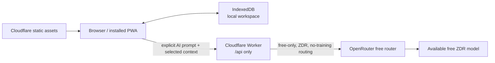

# CALIPAR PWA Demo

CALIPAR is an AI-enhanced program review and integrated-planning platform for
educational institutions. This package is the public, no-login demonstration
edition: it is installable as a Progressive Web App, its workspace is stored in
the visitor's browser, and its optional AI requests are proxied through a small
Cloudflare Worker to OpenRouter's free router.

This package is deliberately isolated from the production CALIPAR application.
It does **not** use or weaken the parent application's Firebase authentication,
FastAPI service, PostgreSQL database, or fail-closed production configuration.

## What the demo includes

- A public landing page and guided entry into a synthetic demo workspace
- Dashboard, program reviews, analytics, action planning, resource requests,
  activity history, settings, import/export, and reset
- IndexedDB persistence and offline access after the first successful load
- Mission-Bot writing and planning assistance using explicitly selected local
  context
- One Cloudflare Worker serving the static export and handling `/api/*`

This is not a production, FERPA, compliance, accreditation, or institutional
records system. All included records are synthetic. Generated content requires
human review.

## Architecture



Static requests bypass Worker execution. The Worker has no server-side
application database and no Cloudflare storage binding. Details and trust
boundaries are in [Architecture](docs/ARCHITECTURE.md) and
[Privacy and AI](docs/PRIVACY_AND_AI.md).

## Requirements

- Node.js 20.9 or newer, but earlier than Node 23
- npm 10 or newer
- Chromium and WebKit Playwright browsers for the complete test suite
- Wrangler authentication only for Cloudflare dry runs and release operations

The dependency versions are pinned in `package.json`; use the lockfile rather
than updating packages during a release.

## Install and run

```bash
npm ci
cp .dev.vars.example .dev.vars
npm run dev
```

`npm run dev` runs the Next.js frontend only. For production-like static asset,
Worker API, and service-worker behavior:

```bash
npm run build
npm run preview
```

Wrangler serves the application at the exact URL it prints. Do not assume a
port or public hostname during release verification.

The application remains usable without AI configuration. To exercise the AI
proxy locally, populate `.dev.vars` with a dedicated OpenRouter key, a random
AI session secret, and Cloudflare's documented Turnstile test credentials.
Never use production credentials in browser-visible variables.

## Data behavior

- Domain data and chat history are stored in the `calipar-demo` IndexedDB
  database for the current browser profile and origin.
- Clearing site data, using another browser profile, or changing origins
  produces a different workspace.
- Reset flushes pending edits, clears domain/chat records, restores the
  deterministic synthetic seed, and preserves appearance/onboarding choices.
- Export produces an unencrypted, versioned JSON backup.
- Import validates and sanitizes the entire file, offers a pre-import backup,
  and transactionally replaces the workspace. It does not merge records.
- AI is network-only. Offline AI requests are neither faked nor queued.

## Commands

| Command | Purpose |
| --- | --- |
| `npm run dev` | Next.js development UI |
| `npm run build` | Static Next export followed by Serwist precache generation |
| `npm run preview` | Production-like Worker and static-asset server |
| `npm run typecheck` | Strict TypeScript verification |
| `npm run lint` | ESLint with zero warnings |
| `npm run test:unit` | Browser-domain and component tests |
| `npm run test:worker` | AI Worker contract and policy tests |
| `npm run test:e2e` | Desktop, mobile, and WebKit workflows |
| `npm run test:a11y` | Axe and keyboard-focused accessibility scenarios |
| `npm run test:lighthouse` | Landing/dashboard Lighthouse budgets |
| `npm run verify:artifacts` | Route, secret, asset-size, and PWA artifact checks |
| `npm run cloudflare:limits` | Workers Free static artifact limits |
| `npm run cloudflare:dry-run` | Authenticated Wrangler bundle dry run |
| `npm run verify` | Main local release gate, including E2E |
| `npm run verify:full` | Main gate plus accessibility and Lighthouse |

See [Testing and evaluation](docs/TESTING.md) for the scenario matrix, evidence,
and the evaluate-fix-repeat procedure.

## AI configuration

The browser cannot select a model, provider, plugin, tool, price, or token
limit. The Worker constructs the upstream request and enforces:

- `model: "openrouter/free"`
- zero maximum prompt, completion, and request prices
- zero-data-retention routing
- provider data collection denied
- no paid fallback
- fixed task schemas, payload limits, timeouts, and normalized errors

AI access also requires same-origin requests, explicit disclosure/consent, a
verified Turnstile session, and edge rate limiting. If free, privacy-compatible
capacity is unavailable, the product reports that state instead of relaxing
the policy or returning canned AI text.

Required Worker secrets:

```text
OPENROUTER_API_KEY
AI_SESSION_SECRET
TURNSTILE_SECRET_KEY
```

`TURNSTILE_SITE_KEY` is public configuration, not a secret. Follow
[Cloudflare release runbook](docs/CLOUDFLARE_DEPLOY.md) for audited secret
creation, immutable previews, promotion, and rollback.

## CI integration

The template at `.github/workflows/pwa-demo-ci.yml` is written for the current
parent repository, where this package lives at `calipar_pwa_demo/`. GitHub does
not execute workflows from a nested `.github` directory. When integration is
approved, copy the template to the parent repository's root `.github/workflows`
directory without changing its working-directory boundary.

The main CI job never deploys or requires production secrets. The optional
Cloudflare dry-run job runs only when explicitly dispatched and requires a
scoped `CLOUDFLARE_API_TOKEN`.

## Release

Do not deploy an uncommitted build or create/overwrite a Worker based only on
its name. The release workflow is:

1. Run `npm ci` and `npm run verify:full`.
2. Confirm the exact Cloudflare account and Workers Free plan.
3. Check whether `calipar-pwa-demo` already exists.
4. Store secrets using interactive `wrangler secret put`.
5. Upload an immutable preview version without changing traffic.
6. Test the exact returned preview URL.
7. Promote that exact version ID, then repeat production smoke tests.
8. Retain the previous verified version ID for rollback.

The exact guarded commands and required confirmations are documented in
[Cloudflare release runbook](docs/CLOUDFLARE_DEPLOY.md).

## License and branding

CALIPAR is BSD-3-Clause licensed with branding requirements. Do not remove or
replace CALIPAR branding without an approved exemption.
